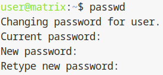

## 1.4 Connexion au terminal et premiere securisation

Une fois la machine virtuelle demarree, nous ne pouvons pas nous y connecter immediatement en SSH classique car nous ne connaissons pas encore son adresse IP ou celle-ci n'est pas encore configuree de maniere statique.

Nous devons donc utiliser la console virtuelle (l'equivalent d'un ecran branche sur la machine) pour les premieres manipulations.

---

### Schéma d'architecture (Accès Console et Flux X11)

```text
[ Poste Utilisateur ] 
       |
       | (1) Connexion SSH avec déport X11 (-X)
       v
[ Serveur dattier.iutinfo.fr ]
       |
       |-- (2) Commande: vmiut console matrix
       |          |
       |          v
       |   [ Flux Vidéo VirtualBox ] --(Retour vers Poste Utilisateur)--> [ Fenêtre Graphique ]
       |
       |-- (3) Connexion SSH Interne
                  |
                  v
           [ VM matrix (IP: 10.42.XX.yy) ]
```

---

## A. Acces via la console graphique (X11)

Le script `vmiut console` lance une fenetre graphique VirtualBox. Pour que cette fenetre s'affiche sur notre poste physique alors que le script tourne sur le serveur distant, nous devons utiliser le X11 Forwarding.

Connectez-vous au serveur `dattier` avec l'option `-X` (depuis votre machine physique ou la passerelle) :

```bash
ssh -X dattier.iutinfo.fr
```

Verifiez que la redirection d'affichage est active en controlant la variable `DISPLAY` :

```bash
echo $DISPLAY
```

Exemple de resultat attendu :

```text
localhost:10.0
```

Si une valeur s'affiche, le transfert graphique est actif.

Lancez la console de la machine virtuelle :

```bash
vmiut console matrix
```

Une fenetre graphique s'ouvre, affichant le terminal de la VM `matrix`.
Connectez-vous avec l'utilisateur `user` et le mot de passe `user`

---

## B. Identification de l'adresse IP temporaire

Dans la fenetre graphique (console), connectez-vous avec l'utilisateur `user` (mot de passe `user`). Pour connaitre l'adresse IP actuelle attribuee par le DHCP, tapez :

```bash
ip addr show
```

Reperez l'interface `enp0s3` et notez l'adresse IP indiquee a la ligne `inet`. Exemple : `10.42.XX.1`.

---

## C. Connexion SSH et changement des mots de passe

La console graphique etant peu pratique pour le copier-coller, nous basculons maintenant sur une connexion SSH classique depuis le serveur `dattier`, en utilisant l'IP recuperee.

Connectez-vous a la VM :

```bash
ssh user@10.42.XX.1
```


Acceptez l'empreinte en tapant `yes` si demande.

Changez le mot de passe de l'utilisateur `user` pour le securiser (remplacez `user` par votre propre mot de passe, ici `aubin`) :

```text
passwd
Current password: user
New password: aubin
Retype new password: aubin
passwd: password updated successfully
```

Activez le compte `root` (Administrateur). Par defaut, `root` n'a pas de mot de passe et est desactive. Passez en mode administrateur temporaire pour definir son mot de passe :

```text
su -
Password: aubin
root@matrix:~# passwd
New password: root
Retype new password: root
passwd: password updated successfully
```


Desormais, la machine est accessible en SSH et les comptes sont securises avec des mots de passe personnalises.

---

## Section dédiée aux problèmes (Troubleshooting)

| Problème | Cause possible | Solution |
| :--- | :--- | :--- |
| **`vmiut console` : "Error: Can't open display"** | Connexion SSH effectuée sans l'option `-X`. | Déconnectez-vous et reconnectez-vous avec `ssh -X dattier.iutinfo.fr`. |
| **Clavier en QWERTY dans la console** | Configuration par défaut de la VM Debian. | Le mot de passe `user` se tape `user`, mais attention aux caractères spéciaux. Utilisez `loadkeys fr` une fois connecté en root. |
| **SSH vers la VM : "Connection refused"** | Le service SSH n'est pas encore démarré sur la VM. | Attendez 30 secondes ou vérifiez que la VM est bien sur l'écran de login dans la console. |
| **`su -` refuse le mot de passe** | Confusion entre le mot de passe de `user` et celui de `root`. | Rappel : au premier `su -`, utilisez le mot de passe de l'utilisateur `user` (ici `aubin`). |

---

## Section Tests de validation

Afin de valider cette étape, réalisez les tests suivants :

1.  **Test de connexion SSH directe :** Tentez de vous connecter depuis `dattier` via `ssh user@10.42.XX.1`. Si vous accédez au prompt sans erreur, le test est validé.
2.  **Test d'intégrité du mot de passe root :** Tapez `su -` puis le mot de passe `root` défini. Si l'invite devient `root@matrix:~#`, l'accès administrateur est opérationnel.
3.  **Vérification de l'interface réseau :** Tapez `ip link show enp0s3`. L'état doit être `UP`.

<hr>

- Page précédente: [Création et gestion de la machine virtuelle](creer-machine-virtuelle.md)
- Page suivante: [Configuration réseau et mise à jour](config-reseau.md)