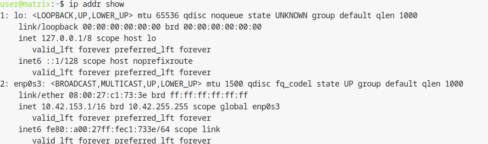
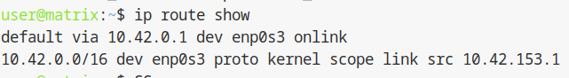
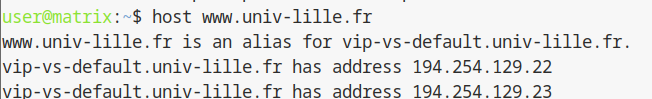

## 1.5 Configuration reseau et mise a jour

Actuellement, la machine virtuelle possede une adresse IP fournie via le protocole DHCP, dans une plage aleatoire.
Pour voir quelle est votre Plage d’adresses IP attribué [cliquez ici](https://moodle.univ-lille.fr/pluginfile.php/2793265/mod_resource/content/6/attribution-ips.html)
  

Chaque etudiant est fourni une plage d'adresses IP de taille CIDR /24. 
-Pour **Aubin CAMBIER**, la plage attribuee est : `10.42.XX.[1-254]` (`10.42.XX.0/24`).
-Pour **Ilyes Mobarek** la plage attribuee est : `10.42.153.[1-254]` (`10.42.153.0/24`).


Ici, la plage va de `10.42.XX.1` a `.254`, les octets `.0` et `.255` etant reserves respectivement a l'adresse de reseau et l'adresse de broadcast.

Nous allons donc modifier la configuration reseau de la machine virtuelle afin de correspondre a une IP statique dans cette plage.

---

### Schéma d'architecture (Réseau de la VM)

```text
[ INTERNET ]
      ^
      |
[ Passerelle / DNS IUT (10.42.0.1) ]
      ^
      | (Liaison Virtuelle)
      |
[ VM matrix (enp0s3) ]
      |-- IP Statique : 10.42.XX.1
      |-- Masque : 255.255.0.0 (/16)
      |-- DNS : 10.42.0.1
```

---

Note : dans les instructions suivantes, l'adresse IP statique utilisee sera `10.42.XX.1`, qui correspond a la premiere adresse disponible de votre plage, destinee a la machine `matrix`.

---

## Modifications permanentes a apporter au reseau

Nous souhaitons que la machine virtuelle possede l'adresse IP statique `10.42.XX.1`.

Nous souhaitons qu'elle utilise le routeur `10.42.0.1`.

Nous souhaitons qu'elle utilise le serveur DNS `10.42.0.1`.

Pour cela, nous nous chargerons de modifier deux fichiers de configuration reseau : ` /etc/network/interfaces` et ` /etc/resolv.conf`.

---

## Connexion en tant qu'administrateur (root)

Cette etape doit etre realisee via la console virtuelle (voir procedure 1.4) pour ne pas perdre la connexion lors du changement d'IP.

Pour les commandes et la configuration qui vont suivre, vous devez etre connecte en tant qu'administrateur/root.

Pour se connecter a l'utilisateur root, executez cette commande :

```bash
su -
```

La commande `su` (pour substitute user) nous permet de changer d'utilisateur. L'utilisateur sans nom donne a la suite nous permet de nous connecter au compte `root`.

Le symbole `-` a la suite de la commande permet de specifier que l'environnement courant de votre session devra etre change par celui de l'utilisateur auquel vous souhaitez acceder. L'utilisateur `root` ayant acces a divers outils speciaux que seul lui peut utiliser, tous presents dans le dossier `/usr/sbin` (pour system binaries).

La commande vous demandera de saisir le mot de passe de l'utilisateur `root` (defini a l'etape precedente).

```text
Password:
root@matrix:~#
```

---

Note : par raison de securite, les mots de passe ne sont pas affiches en clair sur les systemes UNIX, vous ne verrez donc pas votre mot de passe en train d'etre ecrit sur votre terminal.

---

Pour commencer la configuration, eteignez l'interface reseau standard de la machine virtuelle (dans notre cas, `enp0s3`) a l'aide de l'outil `ifdown` (interface down) :

```bash
ifdown enp0s3
```

Pour modifier les fichiers suivants, utilisez l'editeur de texte `nano`.

---

## Fichier `/etc/network/interfaces`

Ce fichier sert a parametrer les interfaces reseau. Ouvrez-le :

```bash
nano /etc/network/interfaces
```

La configuration reseau qui nous interesse (interface `enp0s3`) se trouve tout en bas du fichier. Par defaut, elle ressemble a ceci :

```text
iface enp0s3 inet dhcp
```

Cette ligne se charge de configurer automatiquement l'interface via DHCP. Remplacez cette ligne (et les suivantes si elles existent pour cette interface) par la configuration statique suivante :

```text
auto enp0s3
iface enp0s3 inet static
    address 10.42.XX.1/16
    netmask 255.255.0.0
    gateway 10.42.0.1
```

* La premiere ligne `auto` assure le demarrage automatique de l'interface.
* La deuxieme ligne annonce une configuration statique.
* La troisieme ligne configure votre adresse IP (`10.42.XX.1`) avec le masque `/16`.
* La quatrieme ligne configure la passerelle (routeur).

Sauvegardez (Ctrl+O, Entree) et quittez (Ctrl+X).

---

## Fichier `/etc/resolv.conf`

Ce fichier sert a parametrer le serveur DNS. Ouvrez-le :

```bash
nano /etc/resolv.conf
```

Supprimez le contenu existant et remplacez-le par l'adresse du routeur qui fait office de DNS :

```text
nameserver 10.42.0.1
```

---

## Redemarrage de l'interface reseau et tests

Une fois les deux fichiers configures, redemarrez l'interface reseau `enp0s3` a l'aide de l'outil `ifup` (interface up) :

```bash
ifup enp0s3
```

Pour tester si la configuration reseau a ete correctement prise en compte, executez les 3 commandes suivantes :

```bash
ip addr show
```

Permet de voir la configuration reseau actuelle. Vous devez voir quelque chose comme : `inet 10.42.38.221/16`.




---

```bash
ip route show
```

Permet de voir la configuration de routage. Vous devez voir `default via 10.42.0.1`.




---
```bash
host www.univ-lille.fr
```

Permet d'effectuer une resolution DNS pour verifier l'acces au reseau exterieur.




---
Pour valider que cette configuration est bien permanente, redemarrez la machine virtuelle :

```bash
reboot
```

---

## Questions de connexion root via SSH

Essayez de vous connecter a la machine virtuelle en SSH sur le compte `root` depuis le serveur `dattier`.

Quelle commande avez-vous utilisee ?

```bash
ssh root@10.42.XX.1
```

Que se passe-t-il ? La connexion echoue ("Permission denied"), meme si le mot de passe saisi est correct.

Pourquoi ? Par defaut, le service SSH (`sshd`) est configure pour interdire la connexion directe au compte `root` (`PermitRootLogin` est souvent sur `prohibit-password` ou `no`), car cela represente un risque de securite majeur (attaques par force brute).

Reconnectez-vous avec le compte `user` en utilisant désormais l'adresse IP statique que nous avons configurée dans le fichier interfaces :

```bash
ssh user@10.42.XX.1
```


Lisez la page de manuel `su(1)`.

Quelle est la signification de l'option `--login` (ou `-`) ? L'option `--login` demande au shell de se comporter comme un shell de connexion complet. Elle vide les variables d'environnement de l'ancien utilisateur et charge celles du nouvel utilisateur (ici `root`), en se placant dans son repertoire personnel.

Pourquoi est-il interessant de l'utiliser ? Cela permet a l'utilisateur `root` de beneficier de son propre `PATH` (chemin d'acces aux executables). Sans cette option, les outils d'administration situes dans `/usr/sbin` (comme `reboot`, `useradd`, `ifup`) ne seraient pas trouves directement par le terminal.

Utilisez la commande `su` pour passer `root` correctement :

```bash
su -
```

---

## Mise a jour et installation des outils via `apt`

Par souci de securite, il est important d'avoir les dernieres versions des logiciels. Connecte en tant que `root`, executez :

```bash
apt update
apt full-upgrade -y
```

La premiere commande met a jour la liste des paquets, la seconde installe les nouvelles versions.

Une fois la mise a jour effectuee, il est probable qu'une nouvelle version du noyau Linux ait ete installee. Redemarrez la machine :

```bash
reboot
```

Reconnectez-vous, repassez `root`, et installez les outils requis pour la suite de la SAE :

```bash
apt install vim less tree rsync -y
```

* [`vim`](https://www.vim.org) : editeur de texte avance.
* [`less`](https://linux.die.net/man/1/less) : visualiseur de fichiers.
* [`tree`](https://linux.die.net/man/1/tree) : visualisation d'arborescence.
* [`rsync`](https://rsync.samba.org/) : synchronisation de fichiers.


---

## Configuration de sudo (Droit administrateur pour l'utilisateur)

Plutôt que de devoir se connecter systématiquement au compte `root` avec `su -`, il est recommandé d'ajouter l'utilisateur standard (`user`) au groupe `sudo`. Cela lui permettra d'exécuter des commandes administrateur en préfixant simplement sa commande par `sudo`.

Assurez-vous d'être connecté en `root`, puis installez le paquet `sudo` (s'il n'est pas déjà présent) :

```bash
apt install sudo -y
```

Ajoutez l’utilisateur de confiance username au groupe sudo (ici : a312) :

```bash
usermod -aG sudo a312
```

Pour que ce changement soit pris en compte, l'utilisateur doit se déconnecter et se reconnecter. Vous pourrez ensuite tester en tapant `sudo apt update` depuis le compte `user` (votre mot de passe utilisateur vous sera demandé).

---

## Section dédiée aux problèmes (Troubleshooting)

| Problème | Cause possible | Solution |
| :--- | :--- | :--- |
| **"Network is unreachable"** | Erreur dans le fichier `interfaces` (passerelle). | Vérifiez que `gateway` est bien `10.42.0.1` et que `ifup enp0s3` a été lancé. |
| **"Host not found"** | DNS mal configuré dans `/etc/resolv.conf`. | Vérifiez la syntaxe `nameserver 10.42.0.1` (pas d'espace superflu). |
| **Echec de `apt update`** | Pas d'accès au routeur IUT ou DNS HS. | Testez `ping 10.42.0.1`. Si ça répond, vérifiez la résolution DNS avec `host google.com`. |
| **SSH root refusé** | Sécurité native de SSH. | C'est normal. Connectez-vous en `user` puis faites `su -`. |
| **Erreur de verrou (lock) `apt`** | Une autre instance d'apt tourne en fond. | Attendez quelques minutes ou redémarrez la VM. |

---

## Section Tests de validation

Afin de valider cette procédure, effectuez les vérifications suivantes :

1.  **Test d'IP Statique :** Tapez `ip addr show enp0s3`. L'adresse doit être `10.42.XX.1`.
2.  **Test de Routage :** Tapez `ping -c 3 10.42.0.1`. Vous ne devez avoir aucun paquet perdu.
3.  **Test DNS :** Tapez `host univ-lille.fr`. Une adresse IP doit être retournée.
4.  **Test Sudo :** Tapez `sudo whoami` avec l'utilisateur standard. La réponse doit être `root`.

---

Plus d'informations sur les outils mentionnes dans cette procedure :

* Documentation `OpenSSH`
* Documentation `interfaces`

<hr>

- Page précédente: [Connexion au terminal de la machine virtuelle](AccesVm.md)
- Page suivante: [Création d'alias de connexion SSH](ssh-alias-connexion.md)
