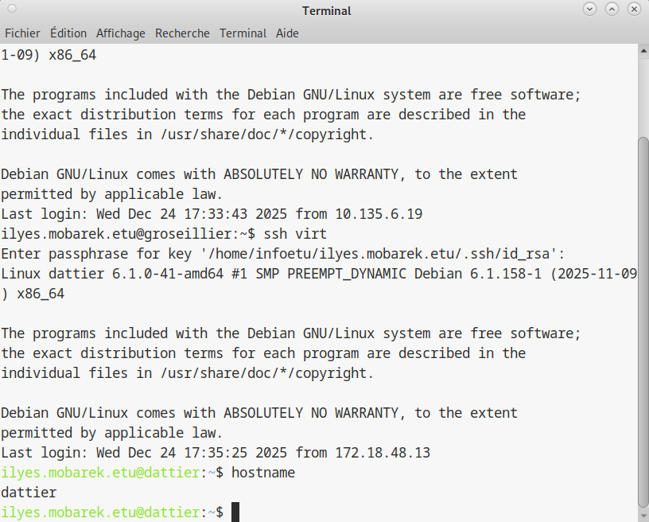
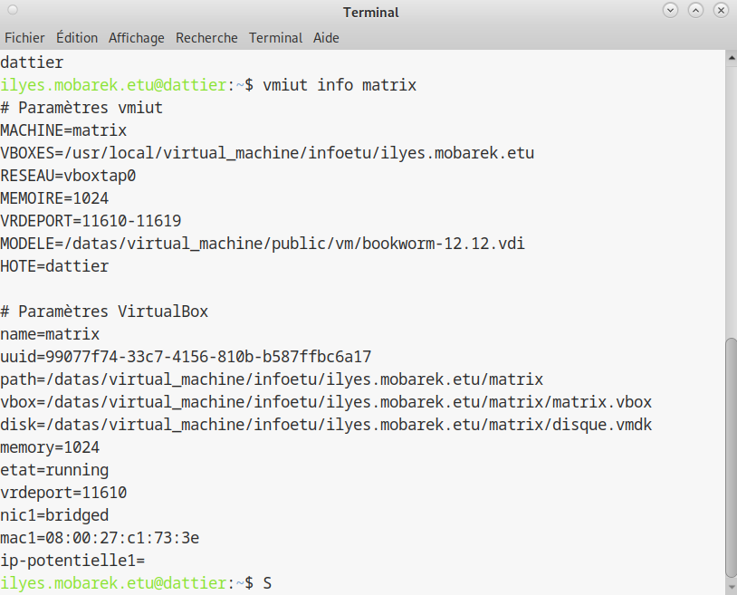

## 1.3 Creation et gestion de la machine virtuelle

### Objectif

Creer une machine virtuelle nommee `matrix` sur le serveur de virtualisation `dattier.iutinfo.fr`, la demarrer, et recuperer son adresse IP pour la suite du TP.

---

### Schéma d'architecture (Virtualisation)

```text
[ Poste Client (PC/TP) ] 
      |
      | SSH
      v
[ Serveur DATTIER ] (Hôte de virtualisation)
      |
      |-- [ Outil vmiut ] (Gestionnaire de VM)
      |         |
      |         |---> [ VM matrix ] (Système invité : Debian 12)
      |               |-- IP : 10.42.XX.yy (Réseau interne XX)
      |               |-- Disque : Image clonée
```

---

## 1. Pre-requis et verification du serveur

Toutes les commandes `vmiut` doivent imperativement etre executees sur le serveur de virtualisation, et non sur votre machine personnelle ou la passerelle SSH.

Connectez-vous au serveur :

```bash
ssh dattier.iutinfo.fr
```

Verification imperative : tapez la commande suivante pour confirmer votre position :

```bash
hostname
```

* Si la reponse est `dattier` : vous pouvez continuer.
* Si la reponse est differente : vous n'etes pas sur le bon serveur. Recommencez la connexion SSH.



---

## 2. Informations techniques de la VM (a noter)

La commande `vmiut` va cloner une image disque pre-configuree (Debian 12). Notez ces identifiants, vous en aurez besoin pour vous connecter a la machine virtuelle plus tard :

* Systeme : Debian GNU/Linux 12 "Bookworm"
* Utilisateur standard :
  * Login : `user`
  * Mot de passe : `user`
* Super-utilisateur (Administrateur) :
  * Login : `root`
  * Mot de passe : `root`

---

## 3. Creation de la VM

Lancez la commande de creation :

```bash
vmiut creer matrix
```

Le script affiche une barre de progression lors du clonage du disque. Une fois l'operation terminee, il affiche un UUID (identifiant unique, ex : `50754f1a...`).

La VM a été créée précédemment. La commande vmiut info matrix confirme l’existence de la VM, son UUID et son adresse IP, ce qui prouve sa création et son état de fonctionnement.



---

## 4. Demarrage de la machine

Meme si la creation peut parfois lancer la machine automatiquement, assurez-vous qu'elle demarre correctement avec la commande :

```bash
vmiut demarrer matrix
```

Le message attendu est :

```text
VM "matrix" has been successfully started.
```

---

## 5. Recuperation de l'adresse IP

C'est l'etape critique. Vous devez recuperer l'adresse IP attribuee automatiquement par le serveur DHCP a votre VM.

Lancez la commande d'information :

```bash
vmiut info matrix
```

Cherchez la ligne commencant par `ip-potentielle1=` ou `ip-possible=`.

### Depannage : si aucune IP ne s'affiche

Si le champ `ip-possible=` est vide, c'est normal. La machine virtuelle vient de demarrer et n'a pas encore finalise sa configuration reseau.

Solution : attendez environ 10 a 15 secondes.

Action : relancez la commande `vmiut info matrix` jusqu'a ce qu'une IP apparaisse (generalement sous la forme `10.42.XX.yy`).

*Note pour le rapport : capture du resultat de la commande montrant l'etat `running` et l'adresse IP visible.*

---

## 6. Commandes de gestion courante

### Arreter la VM (fin de seance)

Pour eteindre proprement la machine et liberer les ressources du serveur :

```bash
vmiut arreter matrix
```

### Supprimer la VM (attention)

Cette commande detruit definitivement la machine et vos fichiers. A utiliser uniquement en cas d'erreur critique pour recommencer a zero :

```bash
vmiut supprimer matrix
```

---

## Section dédiée aux problèmes (Troubleshooting)

| Problème | Cause possible | Solution |
| :--- | :--- | :--- |
| **Commande `vmiut` introuvable** | Vous êtes sur la passerelle `tp` ou sur votre PC. | Reconnectez-vous bien sur `dattier.iutinfo.fr`. |
| **Erreur lors du clonage** | Espace disque insuffisant sur le serveur. | Contactez un administrateur ou vérifiez vos quotas. |
| **La VM refuse de démarrer** | Ressources insuffisantes ou conflit d'UUID. | Tentez un `vmiut supprimer matrix` puis recommencez la création. |
| **IP toujours vide après 1 minute** | La VM a crashé au démarrage ou service DHCP lent. | Redémarrez la VM avec `vmiut arreter` puis `vmiut demarrer`. |
| **VM "matrix" already exists** | La VM a déjà été créée par vous ou un autre utilisateur sur ce compte. | Si c'est la vôtre, passez directement au démarrage. Sinon, utilisez un autre nom. |

---

## Section Tests de validation

Pour confirmer que la VM est opérationnelle, effectuez les tests suivants :

1.  **Test d'état :** Exécutez `vmiut info matrix | grep state`.
    *Résultat attendu : `state=running`.*
2.  **Test de connectivité (Ping) :** Une fois l'IP récupérée (ex: 10.42.XX.yy), lancez :
    ```bash
    ping -c 3 10.42.XX.yy
    ```
    *Résultat attendu : 0% packet loss (le serveur Dattier doit pouvoir joindre la VM).*
3.  **Test d'existence du disque :** Vérifiez si le fichier UUID est bien généré dans le retour de `vmiut info`.

<hr>

- Page précédente: [Gestion des clés de connexion SSH](gestion-des-clés-de-connexion-ssh)
- Page suivante: [Connexion au terminal de la machine virtuelle](AccesVm.md)
