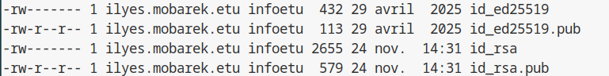
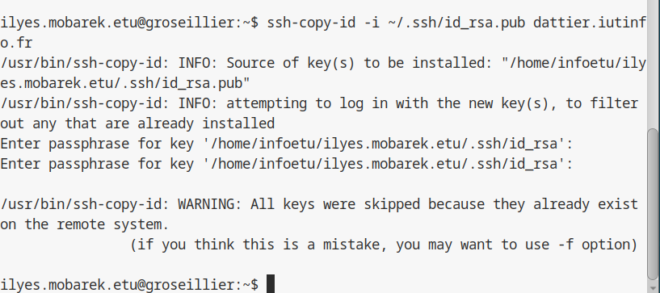
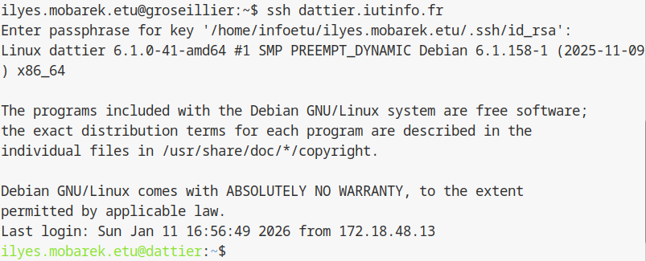

## 1.2 Gestion des clés de connexion SSH

### Objectif

Mettre en place une authentification par **clé asymétrique** afin de se connecter au serveur `dattier.iutinfo.fr`. Cette méthode permet de ne plus saisir le mot de passe IUT à chaque connexion, tout en augmentant la sécurité grâce à la cryptographie.

---

### 1. Comprendre le fonctionnement (Théorie)

Contrairement à une authentification classique par mot de passe, SSH utilise ici une paire de clés cryptographiques :

* **La clé privée** (ex : `id_rsa`) : elle est stockée sur votre machine locale. C'est votre secret personnel, elle ne doit jamais être partagée ni transmise.
* **La clé publique** (ex : `id_rsa.pub`) : elle est transmise au serveur. Elle agit comme un cadenas que seule votre clé privée peut ouvrir.

Lors de la connexion, le serveur vérifie que vous possédez la clé privée correspondant à la clé publique qu'il a en mémoire, sans jamais que la clé privée ne transite sur le réseau.

---

### 2. Pré-requis

* Vous savez vous connecter à `dattier.iutinfo.fr` en SSH.
* Vous effectuez ces manipulations sur la machine depuis laquelle vous lancez la commande `ssh` (machine de TP ou machine passerelle `tp.iutinfo.fr` si vous êtes à distance).

---

### 3. Vérification de l'existant

Avant de générer une nouvelle paire, vérifiez le contenu de votre dossier SSH :

```bash
ls -l ~/.ssh
```

Vous cherchez une paire de fichiers existante, par exemple :

* `id_rsa` et `id_rsa.pub` (algorithme RSA standard)
* `id_ed25519` et `id_ed25519.pub` (algorithme EdDSA plus récent)




Si des clés existent déjà, vous pouvez passer directement à l'étape 5. Sinon, procédez à la génération (étape 4).

---

### 4. Génération de la paire de clés

Nous utilisons l'outil standard `ssh-keygen`.

#### Lancer la commande

```bash
ssh-keygen
```

#### Configuration

* **Emplacement du fichier** : le programme propose un chemin par défaut (`/home/.../.ssh/id_rsa`). Appuyez sur **Entrée** pour valider ce choix standard.
* **La passphrase** :

```text
Enter passphrase (empty for no passphrase):
```

Il est recommandé de saisir une passphrase. C'est un mot de passe qui chiffre la clé privée sur votre disque dur pour la protéger en cas de vol de fichier. Les caractères ne s'affichent pas lors de la saisie, c'est un comportement de sécurité normal.

Une fois terminé, le terminal affiche l'empreinte de la clé et une image en art ASCII ("randomart image").

---

### 5. Transmission de la clé publique au serveur

#### Principe

Pour autoriser votre connexion, le serveur doit inscrire votre clé publique dans son fichier `~/.ssh/authorized_keys`. L'outil `ssh-copy-id` automatise cette tâche de manière sécurisée.

#### Commande

Exécutez la commande suivante (adaptez le nom du fichier si vous n'utilisez pas RSA) :

```bash
ssh-copy-id -i ~/.ssh/id_rsa.pub dattier.iutinfo.fr
```

Le script va initier une connexion SSH temporaire :

* il vous demandera votre mot de passe IUT actuel ;
* il copiera la clé publique au bon endroit sur le serveur.

Vous devez obtenir le message : `Number of key(s) added: 1`.

*Remarque : lors de l’exécution de ssh-copy-id, aucun ajout de clé n’a été effectué car la clé publique existait déjà sur le serveur. Le message affiché "all keys were skipped because they already exist on the remote system" confirme que l’étape avait déjà été réalisée auparavant.*




---

### 6. Test de la connexion

Tentez une connexion pour valider le fonctionnement :

```bash
ssh dattier.iutinfo.fr
```

#### Résultat attendu

* le serveur ne demande plus le mot de passe IUT ;
* si vous avez défini une passphrase, une fenêtre ou le terminal vous la demandera une seule fois ;
* un programme système appelé Agent SSH mémorisera la clé déverrouillée pour la durée de votre session.



---

### Section dédiée au problème

| Problème | Cause possible | Solution |
| :--- | :--- | :--- |
| **"Permission denied (publickey)"** | La clé publique n'a pas été copiée ou mauvaise identité envoyée. | Relancez `ssh-copy-id`. Si le problème persiste, lancez `ssh -v dattier.iutinfo.fr` pour voir quelle clé est proposée. |
| **"Agent admitted failure to sign"** | Problème de communication avec l'agent SSH. | Redémarrez votre session ou ajoutez manuellement la clé avec `ssh-add`. |
| **Le mot de passe IUT est toujours demandé** | La clé n'est pas utilisée ou `ssh-copy-id` a échoué (réf XX). | Vérifiez que le fichier `~/.ssh/authorized_keys` sur le serveur contient bien votre clé publique. |
| **Passphrase oubliée** | Sécurité : la clé privée est verrouillée. | Il est impossible de récupérer une passphrase. Supprimez la paire de clés et recommencez à l'étape 4. |

---

### Tests de validation

Afin de s'assurer du bon fonctionnement de l'authentification par clé, effectuez ces trois tests :

1.  **Test de non-interactivité :** Fermez votre session et reconnectez-vous. Si vous arrivez sur le prompt de `dattier` sans taper votre mot de passe IUT, le test est **validé**.
2.  **Vérification de l'Agent :** Tapez `ssh-add -l`. Si vous voyez votre empreinte de clé s'afficher, l'agent SSH gère correctement votre identité.
3.  **Contrôle distant :** Exécutez `ssh dattier.iutinfo.fr "cat ~/.ssh/authorized_keys"`. Si votre clé publique s'affiche à l'écran, elle est correctement enregistrée sur le serveur.

<hr>

- Page précédente: [Connexion à distance au serveur de virtualisation](connexion-serveur-virtualisation.md)
- Page suivante: [Création et gestion de la machine virtuelle](creer-machine-virtuelle.md)
