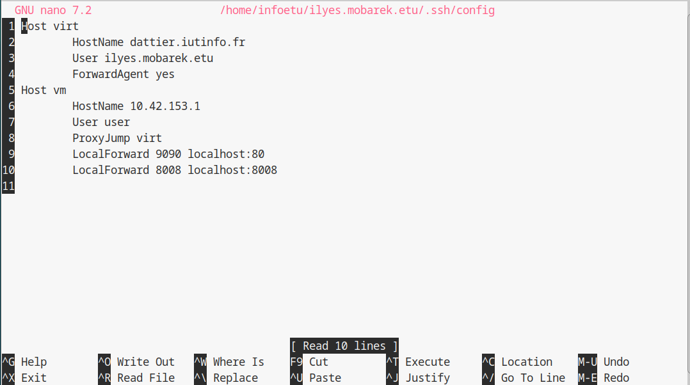
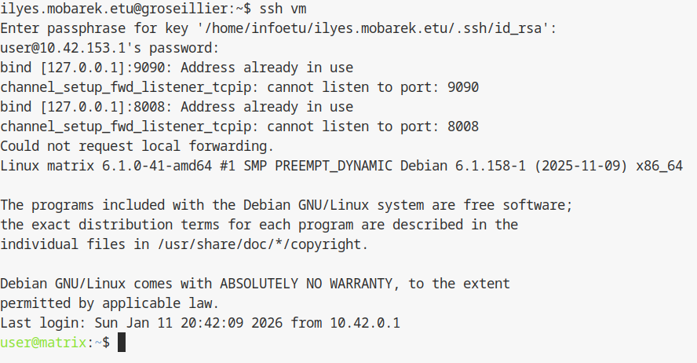

## 1.6 Creation d'alias de connexion SSH

Pour faciliter la connexion depuis les ordinateurs de l'IUT (ou votre machine personnelle) vers le serveur de virtualisation et la machine virtuelle, nous allons configurer le client SSH. Cela nous evitera de taper les adresses IP et les logins complets a chaque fois.

---

### Schéma d'architecture (ProxyJump)

```text
[ Poste Local (TP/Maison) ] 
       |
       |-- Commande : "ssh vm"
       |
       v (Connexion 1)
[ Serveur virt (dattier.iutinfo.fr) ]
       |
       v (Saut automatique / ProxyJump)
[ VM matrix (10.42.XX.1) ]
```

---

## Configuration du fichier SSH local

Cette operation s'effectue sur votre machine physique (celle devant vous, par exemple `frene07` ou votre PC personnel), et non sur le serveur `dattier`.

Creez ou editez le fichier de configuration SSH dans votre dossier personnel :

```bash
nano ~/.ssh/config
```

Inserez les lignes suivantes. Le premier bloc configure l'acces au serveur `dattier` (alias `virt`) et le second configure l'acces direct a votre VM (alias `vm`) en passant automatiquement par le serveur (ProxyJump).

```text
Host virt
    HostName dattier.iutinfo.fr
    User aubin.cambier.etu
    ForwardAgent yes
    ForwardX11 yes

Host vm
    Hostname 10.42.XX.1
    User user
    ProxyJump virt
```

Comme ceci : 



### Details de la configuration

* `User aubin.cambier.etu` : votre identifiant IUT pour la connexion au serveur.
* `ForwardX11 yes` : active automatiquement la redirection graphique (plus besoin de taper `-X`).
* `Hostname 10.42.XX.1` : l'adresse IP statique que nous avons configuree pour votre VM `matrix`.
* `ProxyJump virt` : indique a SSH de se connecter d'abord a `virt` (`dattier`) pour atteindre la VM, ce qui permet de traverser le reseau prive en une seule commande.

Sauvegardez le fichier (Ctrl+O, Entree) et quittez (Ctrl+X).

---

## Tests de connexion

Nous pouvons maintenant tester les raccourcis crees.

### 1. Test de connexion au serveur de virtualisation

Au lieu de taper `ssh -X dattier.iutinfo.fr`, tapez simplement :

```bash
ssh virt
```

Vous devriez arriver sur l'invite de commande de `dattier`. Deconnectez-vous (`exit`) pour tester le second alias.

### 2. Test de connexion directe a la VM

Pour vous connecter directement a votre machine virtuelle depuis votre poste physique :

```bash
ssh vm
```

SSH va automatiquement etablir la connexion via `dattier` et vous demander le mot de passe de l'utilisateur `user` (ou utiliser votre cle si elle est configuree partout).



---

## Section dédiée aux problèmes (Troubleshooting)

| Problème | Cause possible | Solution |
| :--- | :--- | :--- |
| **"Bad owner or permissions on ~/.ssh/config"** | Les permissions du fichier config sont trop ouvertes. | Tapez `chmod 600 ~/.ssh/config`. SSH exige que ce fichier ne soit lisible que par vous. |
| **"ssh: Could not resolve hostname virt"** | L'alias n'est pas reconnu ou erreur de syntaxe dans le fichier. | Vérifiez l'orthographe du mot `Host` et le nom de l'alias dans votre fichier config. |
| **"kex_exchange_identification" ou erreur ProxyJump** | Le serveur `virt` est injoignable ou l'IP de la VM est incorrecte. | Testez `ssh virt` d'abord. Si cela fonctionne, vérifiez l'IP `10.42.XX.1` dans la section `Host vm`. |
| **Demande de mot de passe à chaque saut** | Les clés SSH ne sont pas configurées sur `dattier` ou la VM. | Relancez `ssh-copy-id virt` puis `ssh-copy-id vm` pour automatiser totalement l'accès. |

---

## Section Tests de validation

Réalisez ces tests pour confirmer la validité de vos alias :

1.  **Vérification du saut (ProxyJump) :** Tapez `ssh vm "hostname ; hostname -I"`.
    *Résultat attendu : La commande doit renvoyer "matrix" et l'IP "10.42.XX.1" sans vous demander de vous connecter manuellement à dattier.*
2.  **Vérification X11 :** Connectez-vous avec `ssh virt`, puis tapez `echo $DISPLAY`.
    *Résultat attendu : Une valeur type "localhost:10.0" doit s'afficher automatiquement.*
3.  **Test de syntaxe :** Tapez `ssh -G vm`.
    *Résultat attendu : Le terminal affiche la configuration complète générée par SSH (Hostname, User, ProxyJump) sans erreur.*

---

Plus d'informations sur les outils mentionnes dans cette procedure :

* Documentation de `ssh_config`

<hr>

- Page précédente: [Connexion au terminal de la machine virtuelle](config-reseau.md)
- Page suivante: [Sommaire (partie 2)](../2-configuration-service/README.md)