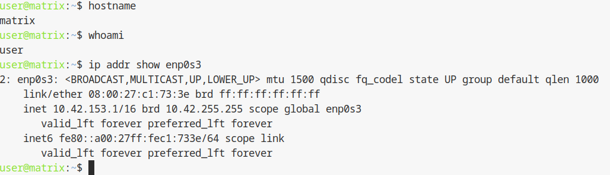
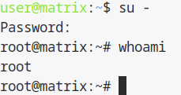

## 2.0 Pre-requis et positionnement (Version Améliorée)

### Objectif
Cette étape est une **phase de validation critique**. Elle permet de s'assurer que vous travaillez sur le bon environnement (la VM `matrix`) et non sur l'hôte (`dattier`), et que vous possédez les privilèges nécessaires pour les installations lourdes de la semaine 2.

---

### Schéma d'architecture (Flux de connexion)

Il est crucial de comprendre l'empilement des connexions pour ne pas se tromper de cible :

```text
[ Votre PC / Machine TP ] 
       |
       |  (Saut 1 : SSH ou Alias 'virt')
       v
[ Serveur dattier.iutinfo.fr ] 
       |
       |  (Saut 2 : SSH ou Alias 'vm')
       v
[ VM matrix (IP: 10.42.XX.1) ] <--- ZONE DE TRAVAIL ACTUELLE
```

---

### Etape 1 : Connexion à la machine virtuelle

Utilisez l'alias configuré précédemment pour un accès rapide. Si vous avez correctement configuré votre fichier `~/.ssh/config`, une seule commande suffit :

```bash
ssh vm
```

*Rappel : Si l'alias ne fonctionne pas, la commande manuelle depuis `dattier` est :*
```bash
ssh user@10.42.XX.1
```

---

### Etape 2 : Vérification du positionnement (Utilisateur standard)

Avant toute modification système, validez votre identité et votre adresse IP pour confirmer que la configuration réseau de la semaine 1 est toujours active.

Executez :
```bash
hostname
whoami
ip addr show enp0s3 | grep "inet "
```

**Résultats attendus :**
*   **Nom d'hôte :** `debian` ou `matrix`.
*   **Utilisateur :** `user`.
*   **Réseau :** L'IP doit être `10.42.XX.1`.



---

### Etape 3 : Élévation de privilèges (Passage en Root)

Pour les installations (Sudo, PostgreSQL, Synapse), le compte `user` ne suffit pas encore. Nous utilisons `su -` pour devenir administrateur total.

```bash
su -
```
*Saisissez le mot de passe root défini en semaine 1.*

**Validation :**
```bash
whoami
```
**Résultat attendu :** La réponse doit être `root` et votre prompt doit se terminer par `#`.



---

## Section dédiée aux problèmes (Troubleshooting)

| Problème | Cause possible | Solution |
| :--- | :--- | :--- |
| **"ssh: connect to host 10.42.XX.1 port 22: Connection refused"** | La VM est éteinte ou le service SSH est planté. | Sur `dattier`, faites `vmiut demarrer matrix` puis attendez 15 secondes. |
| **Le mot de passe root est refusé** | Erreur de clavier (QWERTY) ou oubli. | Testez de taper le mot de passe en clair dans le champ login pour vérifier les touches. |
| **"Hostname: dattier" (Erreur critique)** | Vous n'avez pas fait le second saut vers la VM. | **STOP !** Ne lancez rien sur dattier. Tapez `exit` et relancez `ssh vm`. |
| **L'IP affichée est en 10.0.2.15 (DHCP)** | La configuration statique n'a pas survécu au reboot. | Reprenez la procédure 1.5 (Fichier `/etc/network/interfaces`). |

---

## Section Tests de validation

Effectuez ces tests avant de passer à la suite (Changement de Hostname) :

1.  **Test d'accès Internet :**
    ```bash
    ping -c 2 google.fr
    ```
    *Indispensable pour les futurs `apt install`.*
2.  **Test de l'Agent SSH :**
    ```bash
    ssh-add -l
    ```
    *Vérifiez si vos clés sont transmises (évite de retaper le mot de passe).*
3.  **Vérification de l'espace disque :**
    ```bash
    df -h /
    ```
    *Assurez-vous qu'il reste de la place pour PostgreSQL (min 500Mo libres).*

<hr>

- Page précédente: [Sommaire](README.md)
- Page suivante: [Changement du nom de machine (hostname)](config-hostname.md)