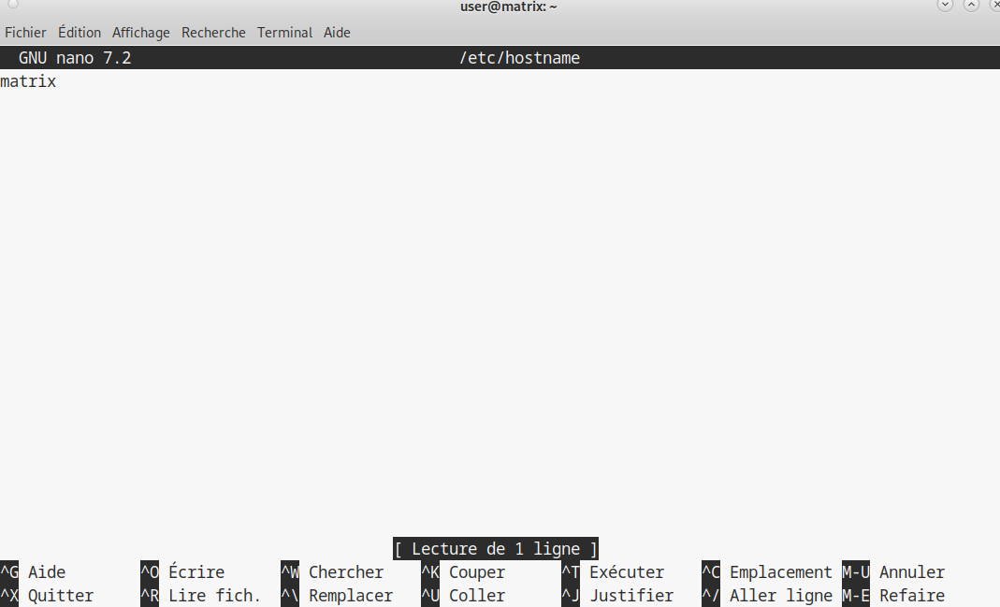

## 2.1 Changement du nom de machine (hostname)

### Objectif

La machine virtuelle s'appelle par defaut `debian`. Nous devons la renommer `matrix` pour qu'elle soit facilement identifiable. Ce changement doit etre persistant, c'est-a-dire qu'il doit rester apres un redemarrage.

---

### Etape 1 : Modification du fichier `hostname`

Le fichier `/etc/hostname` contient le nom actuel de la machine.

Connectez-vous en `root` :

```bash
su -
```

Ouvrez le fichier :

```bash
nano /etc/hostname
```

Remplacez le nom `debian` par `matrix`. Sauvegardez (Ctrl+O) et quittez (Ctrl+X).

Maintenant, cela devrait ressembler à ceci :


---

### Etape 2 : Modification du fichier `hosts` (correction d'erreur critique)

Pourquoi cette etape est cruciale ? Si vous changez le hostname sans modifier ce fichier, votre machine ne saura pas "qui est matrix". Cela provoque une erreur tres frequente lors de l'utilisation de `sudo` plus tard :

```text
sudo: unable to resolve host matrix: Name or service not known
```

De plus, la commande prendra beaucoup de temps a s'executer.

Ouvrez le fichier `hosts` :

```bash
nano /etc/hosts
```

Cherchez la ligne qui associe l'adresse de boucle locale au nom de la machine (generalement la deuxieme ligne):

```text
127.0.1.1       debian
```

Remplacez `debian` par `matrix` :

```text
127.0.1.1       matrix
```

Ne touchez pas a la ligne `127.0.0.1 localhost`.

Sauvegardez et quittez.


---

### Etape 3 : Application et verification

Pour que le changement soit pris en compte partout (noyau, logs, services), un redemarrage est necessaire.

Redemarrez la machine :

```bash
reboot
```

Reconnectez-vous (via `ssh vm` ou l'IP).

Verifiez votre invite de commande (prompt) :

* Avant : `user@debian:~$`
* Maintenant : `user@matrix:~$`

Testez la resolution de nom locale avec un ping :

```bash
ping matrix
```

Resultat attendu :

```text
PING matrix (127.0.1.1) 56(84) bytes of data.
64 bytes from matrix (127.0.1.1): icmp_seq=1 ttl=64 time=0.048 ms
```

Si le ping fonctionne, votre configuration est correcte et vous n'aurez pas de problemes de resolution de nom.


---

## Section dédiée aux problèmes (Troubleshooting)

| Problème | Cause possible | Solution |
| :--- | :--- | :--- |
| **"sudo: unable to resolve host matrix"** | Le fichier `/etc/hosts` n'a pas été mis à jour avec le nouveau nom. | Re-modifiez `/etc/hosts` pour que `127.0.1.1` pointe vers `matrix`. |
| **Le prompt affiche toujours `debian`** | La machine n'a pas redémarré ou `/etc/hostname` est mal écrit. | Vérifiez le contenu de `/etc/hostname` et redémarrez avec `reboot`. |
| **Erreur de permission lors du nano** | Tentative de modification en tant qu'utilisateur standard. | Assurez-vous d'avoir fait `su -` avant de lancer nano. |
| **Le ping matrix renvoie une IP publique** | Conflit avec un nom de domaine existant sur le réseau. | Vérifiez que la ligne `127.0.1.1 matrix` est bien présente en haut du fichier `/etc/hosts`. |

---

## Section Tests de validation

Réalisez ces tests pour confirmer le succès du changement d'identité :

1.  **Vérification de la variable système :** Tapez `hostname`.
    *Résultat attendu : `matrix`.*
2.  **Test de résolution interne :** Tapez `getent hosts matrix`.
    *Résultat attendu : `127.0.1.1 matrix`.*
3.  **Test de latence de sudo :** Tapez `sudo -k; sudo true` (si sudo est déjà configuré).
    *Résultat attendu : La commande doit s'exécuter instantanément sans message d'erreur d'hôte inconnu.*

<hr>

- Page précédente: [Pré requis](Pré-requis.md)
- Page suivante: [Installation et configuration de sudo](config-sudo.md)