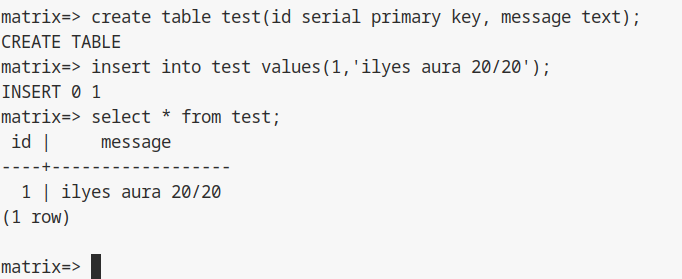

## 2.3 Installation et configuration de la base de donnees PostgreSQL

### Objectif

Installer le systeme de gestion de base de donnees (SGBD) PostgreSQL, le configurer pour un lancement automatique, et creer une base dediee pour le futur service Matrix/Synapse. Nous verifierons egalement que la base est bien accessible via le reseau (TCP/IP).

---

### Schéma d'architecture (Flux de données)

```text
[ Application Synapse ]  (Futur client)
          |
          | (Connexion TCP via localhost:5432)
          v
[ Service PostgreSQL ] <--- (Processus système)
          |
          |-- [ Base de données : matrix ]
          |-- [ Utilisateur : matrix ]
```

---

### Etape 1 : Installation et activation du service

Nous devons installer le serveur PostgreSQL ainsi que le client pour pouvoir envoyer des requetes.

Connectez-vous a la VM et executez (avec votre utilisateur `user` qui a maintenant les droits `sudo`).

Mettez a jour la liste des paquets :

```bash
sudo apt update
```

Installez les paquets necessaires :

```bash
sudo apt install postgresql postgresql-client -y
```

Note : le paquet `postgresql` installe la derniere version stable disponible, par exemple la version 15.

Important : activez le service pour qu'il demarre automatiquement a chaque redemarrage de la machine virtuelle :

```bash
sudo systemctl enable postgresql
```

Verifiez que le service est bien demarre actuellement :

```bash
sudo systemctl status postgresql
```

Resultat attendu : une ligne indiquant `Active: active (running ou exited)`. Tapez `q` pour quitter l'affichage du statut.


---

### Etape 2 : Creation de l'utilisateur de base de donnees

Nous devons creer un "role" (utilisateur PostgreSQL) nomme `matrix`.

Nous allons utiliser la commande `sudo -u postgres` pour executer des commandes en tant qu'administrateur de base de donnees systeme.

Executez la commande suivante :

```bash
sudo -u postgres createuser -P matrix
```

L'option `-P` demandera de definir un mot de passe.

Mot de passe a saisir : `matrix` (puis confirmez-le). Note de securite : dans un environnement reel de production, il faudrait choisir un mot de passe complexe different du nom d'utilisateur.

---

### Etape 3 : Creation de la base de donnees

Nous allons creer la base de donnees nommee `matrix` et definir l'utilisateur `matrix` comme son proprietaire (`-O`).

```bash
sudo -u postgres createdb -O matrix matrix
```

Note sur l'avertissement possible : si vous voyez le message `could not change directory to "/home/user": Permission denied`, c'est normal et sans gravite. Explication : vous etes dans `/home/user`. L'utilisateur systeme `postgres` (qui lance la commande) n'a pas le droit de lire ce dossier personnel. Cela n'empeche pas la creation de la base de donnees de reussir.

---

### Etape 4 : Verification et tests de connexion (crucial)

Cette etape est obligatoire pour valider votre installation. Nous allons verifier que la base est accessible via le reseau local (`localhost`) en TCP/IP, car c'est ainsi que le logiciel Synapse s'y connectera plus tard.

#### 1. Connexion au client interactif

```bash
psql -h localhost -d matrix -U matrix
```

* `-h localhost` : force la connexion via le reseau TCP/IP (au lieu du socket fichier par defaut).
* `-d matrix` : nom de la base cible.
* `-U matrix` : nom de l'utilisateur.

Saisissez le mot de passe `matrix`. Votre invite de commande doit devenir `matrix=>`.

#### 2. Test d'ecriture (creation de table)

Pour confirmer que l'utilisateur a bien les droits d'ecriture, creez une table temporaire :

```sql
CREATE TABLE test (id SERIAL PRIMARY KEY, message TEXT);
```

Reponse attendue : `CREATE TABLE`.

Inserez des donnees de test :

```sql
INSERT INTO test (message) VALUES ('Test de connexion reussi');
```

Reponse attendue : `INSERT 0 1`.

#### 3. Test de lecture (select)

Affichez le contenu de la table :

```sql
SELECT * FROM test;
```

Resultat attendu :

```text
 id |         message          
----+--------------------------
  1 | Test de connexion reussi
(1 row)
```

Exemple ici : 



#### 4. Nettoyage et quitter

Maintenant que le test est valide, nous supprimons la table temporaire pour laisser la base propre :

```sql
DROP TABLE test;
```

Reponse attendue : `DROP TABLE`.

Quittez le client SQL :

```sql
\q
```

---

## Section dédiée aux problèmes (Troubleshooting)

| Problème | Cause possible | Solution |
| :--- | :--- | :--- |
| **`psql: error: connection to server on socket... failed`** | Le service PostgreSQL n'est pas démarré. | Relancez le service : `sudo systemctl start postgresql`. |
| **`password authentication failed for user "matrix"`** | Erreur de saisie ou mot de passe mal défini à l'étape 2. | Supprimez le rôle et recommencez : `sudo -u postgres dropuser matrix`. |
| **`database "matrix" already exists`** | La base a déjà été créée lors d'une tentative précédente. | Supprimez la base existante : `sudo -u postgres dropdb matrix`. |
| **`Permission denied` (avertissement homedir)** | Vous lancez une commande `sudo -u postgres` depuis un dossier privé. | Ignorez l'erreur ou déplacez-vous dans `/tmp` avant de lancer la commande. |
| **Impossible de se connecter via `-h localhost`** | PostgreSQL n'écoute pas sur l'interface réseau locale. | Vérifiez le fichier `/etc/postgresql/XX/main/postgresql.conf` (ligne `listen_addresses`). |

---

## Section Tests de validation

Effectuez ces tests finaux pour garantir la persistance de la configuration :

1.  **Test de persistance au démarrage :** Tapez `sudo reboot`. Après redémarrage, tapez `systemctl is-active postgresql`.
    *Résultat attendu : `active`.*
2.  **Test de privilèges :** Connectez-vous avec `psql -h localhost -d matrix -U matrix` et tentez de créer une table.
    *Résultat attendu : Pas d'erreur "Permission Denied".*
3.  **Test de version :** Tapez `psql --version`.
    *Résultat attendu : Version 15 (ou supérieure).*

<hr>

- Page précédente: [2.2 Installation et configuration de sudo](./config-sudo.md)
- Page suivante: [Sommaire (partie 3)](../3-synapse/README.md)