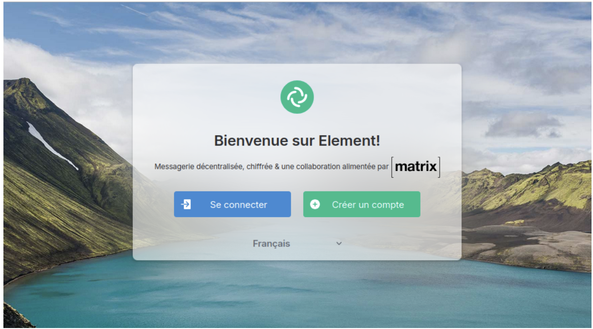
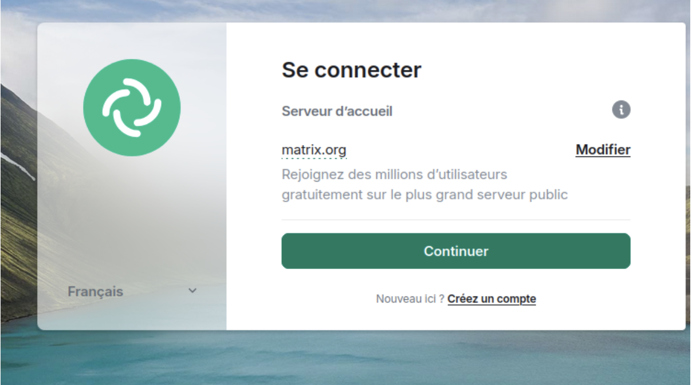

## 3.3 Acces via Element Web et tunnel SSH

### Objectif

L'installation en ligne de commande est terminee. Nous allons maintenant valider le fonctionnement du serveur Synapse en nous y connectant avec un vrai client graphique : Element Web. Comme notre serveur est isole dans un reseau prive, nous utiliserons un tunnel SSH pour y acceder depuis le navigateur de la machine physique.

---

### Schéma d'architecture (Tunnel SSH LocalForward)

Le tunnel permet de "ramener" un service distant sur votre propre machine :

```text
[ Poste Physique (Navigateur) ] <--- (Port 8008 local) ---\
                                                         |
      (Tunnel SSH chiffré traversant Internet/VPN)        |
                                                         |
[ Serveur Dattier (Passerelle virt) ] <------------------/
          |
[ VM Matrix (10.42.XX.1) ] <--- (Port 8008 distant)
```

---

## 1. Configuration du tunnel SSH

Pour acceder au port 8008 (le port d'ecoute de Synapse) de la VM depuis notre machine physique, nous devons modifier la configuration SSH.

Sur votre machine physique, editez le fichier de configuration :

```bash
nano ~/.ssh/config
```

Ajoutez la ligne `LocalForward 8008 localhost:8008` dans le bloc de votre VM. Votre configuration doit ressembler a ceci :

```text
Host vm
    Hostname 10.42.XX.1
    User user
    ProxyJump virt
    LocalForward 9090 localhost:80     # Tunnel pour Nginx (web)
    LocalForward 8008 localhost:8008   # Tunnel pour Synapse (Matrix)
```

Explication de la commande : `LocalForward 8008 localhost:8008` signifie : "Prends tout ce qui arrive sur le port 8008 de mon PC physique et envoie-le dans le tunnel SSH vers le port 8008 de la machine virtuelle (localhost du point de vue de la VM)."

Sauvegardez et quittez.

---

## 2. Activation du tunnel

Pour que la modification soit prise en compte, vous devez fermer votre session SSH actuelle et vous reconnecter.

```bash
exit
ssh vm
```

---

## 3. Connexion via Element Web

L'IUT met a disposition une instance du client Element Web. Ouvrez un navigateur (Firefox ou Chromium) sur votre machine physique et allez a l'adresse :

```text
http://element.iutinfo.fr:8888/
```

Attention : configuration du serveur d'accueil. Par defaut, le client Element tente de se connecter au serveur public `matrix.org`. Nous devons le rediriger vers notre tunnel.

Cliquez sur le bouton Modifier (ou Edit) a cote de "Serveur d'accueil" (Homeserver).

Remplacez l'URL par :

```text
http://localhost:8008
```

Cliquez sur Continuer.



---

## 4. Creation de compte et test

Une fois connecte a votre serveur domestique (`localhost:8008`) :

* Connexion admin : connectez-vous avec l'utilisateur `admin` (ou votre pseudo) cree lors de l'etape precedente en ligne de commande.
* Creation d'un second utilisateur : deconnectez-vous et creez un nouveau compte (ex : `testuser`) via le bouton "Creer un compte".

Note : cela fonctionne car nous avons active `enable_registration` dans la procedure 3.2.



### Discussion

* Connectez-vous avec le premier utilisateur.
* Creez un salon de discussion (bouton "+").
* Invitez le second utilisateur (ou l'utilisateur de votre binome s'il a configure son serveur).
* Envoyez des messages pour valider que la base de donnees enregistre bien les evenements.

---

## Section dédiée aux problèmes (Troubleshooting)

| Problème | Cause possible | Solution |
| :--- | :--- | :--- |
| **"Error: Port 8008 already in use"** | Un autre tunnel ou une autre application occupe déjà ce port sur votre PC. | Changez le port local (ex: `LocalForward 8888 localhost:8008`) et utilisez `http://localhost:8888` dans Element. |
| **Element affiche "Impossible de joindre le serveur"** | Le service Synapse est arrêté sur la VM ou le tunnel est mal configuré. | Vérifiez le statut sur la VM (`systemctl status matrix-synapse`) et assurez-vous d'être connecté en SSH via `ssh vm`. |
| **Le tunnel ne s'active pas** | La modification du fichier `config` n'a pas été relancée. | Fermez **tous** les terminaux SSH ouverts vers `vm` et `virt` et reconnectez-vous. |
| **Mot de passe oublié** | L'utilisateur créé via Element ne peut pas se reconnecter. | Réinitialisez-le en ligne de commande sur la VM avec `register_new_matrix_user`. |

---

## Section Tests de validation

Effectuez ces tests pour confirmer le succès de la mise en réseau :

1.  **Vérification du tunnel local :** Sur votre machine physique (Linux/Mac), tapez `ss -ltn | grep 8008`.
    *Résultat attendu : Une ligne LISTEN sur 127.0.0.1:8008.*
2.  **Test de réponse HTTP :** Dans votre navigateur physique, allez sur `http://localhost:8008`.
    *Résultat attendu : Un message "It works! Matrix is running." s'affiche.*
3.  **Test d'inscription :** Créez un compte via l'interface Element.
    *Résultat attendu : Redirection vers le tableau de bord Element (succès de la transaction avec PostgreSQL).*
4.  **Vérification des logs :** Sur la VM, tapez `journalctl -f -u matrix-synapse`.
    *Résultat attendu : Des lignes de logs défilent lors de vos actions sur Element.*

---

## Note sur le chiffrement

Vous verrez probablement des avertissements concernant la securite ou le chiffrement. C'est normal : nous utilisons une connexion HTTP simple (non securisee par TLS/HTTPS) via un tunnel. Le protocole Matrix est concu pour fonctionner en HTTPS. Tant que nous sommes en HTTP, certaines fonctionnalites de securite (comme la validation des cles ou la federation avec d'autres serveurs externes) ne fonctionneront pas ou afficheront des erreurs.

<hr>

Page precedente : [3.2 : Installation et configuration de Synapse](install-and-config-synapse.md)

Page suivante : [3.4 : Gestion du changement de machine physique](changement-machine.md)