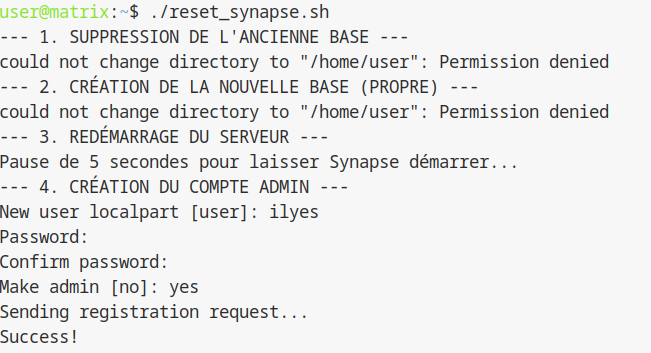

## 3.4 Gestion du changement de machine physique

### Objectif

A l'IUT, nous changeons de poste de travail a chaque seance. Cela pose un probleme majeur pour Synapse. Lors de l'installation, nous avons defini le nom du serveur (Server Name) comme etant `machine-physique.iutinfo.fr:8008`. Ce nom est inscrit en dur dans la base de donnees.

Si vous changez de machine (par exemple de `frene07` a `frene08`), le tunnel SSH changera, mais Synapse croira toujours etre sur `frene07`. Il refusera de fonctionner correctement.

Comme il est impossible de changer le nom d'un serveur Matrix sans corrompre l'integrite des echanges, la seule solution en environnement de TP est de reinitialiser la base de donnees a chaque changement de salle.

---

### Schéma Logique du Changement d'Identité

```text
[ Ancienne Session ] : DB liée à freneXX.iutinfo.fr
        |
        v (Changement de salle)
[ Nouvelle Session ] : Besoin de freneYY.iutinfo.fr
        |
        |--- 1. MAJ Config (homeserver.yaml) : Server_Name = freneYY
        |--- 2. Reset DB (Suppression/Recréation)
        |--- 3. Relance Synapse
        v
[ Serveur Opérationnel sur freneYY ]
```

---

## Preparation : recuperer le nouveau nom

Avant de toucher a la VM, vous devez connaitre le nom complet de votre nouvelle machine physique. Sur le terminal de votre machine physique, tapez :

```bash
hostname -f
```

Exemple de resultat : `frene10.iut-infobio.priv.univ-lille1.fr`. Notez ce nom (ou la version courte `frene10.iutinfo.fr`).

---

## Methode recommandee : creation d'un script d'automatisation

Comme cette operation devra etre repetee souvent, il est inutile de taper les commandes manuellement a chaque fois (risque d'erreur). Nous allons creer un script bash qui fera tout le travail.

### 1. Creation du script

Connectez-vous a votre VM (`ssh vm`) et creez un fichier nomme `reset_synapse.sh` :

```bash
nano reset_synapse.sh
```

Copiez-y le contenu suivant. Ce script arrete le serveur, supprime la base, la recree avec les bonnes options (encodage UTF8 et locale C) et relance le tout.

```bash
#!/bin/bash

# 1. Arret du serveur pour liberer la base de donnees
echo "--- ARRET DU SERVEUR ---"
sudo systemctl stop matrix-synapse

# 2. Suppression de l'ancienne base (qui contient le mauvais nom)
echo "--- SUPPRESSION DE LA BASE ---"
sudo -u postgres dropdb matrix

# 3. Creation de la nouvelle base propre
# Les options --locale=C et --encoding=UTF8 sont obligatoires pour Synapse
echo "--- CREATION DE LA NOUVELLE BASE ---"
sudo -u postgres createdb -O matrix matrix --encoding=UTF8 --locale=C -T template0

# 4. Redemarrage du serveur
echo "--- DEMARRAGE DU SERVEUR ---"
sudo systemctl start matrix-synapse

echo "Termine. Le serveur redemarre..."
```

Sauvegardez (Ctrl+O) et quittez (Ctrl+X).

Rendez le script executable :

```bash
chmod +x reset_synapse.sh
```

---

## 2. Procedure a suivre en debut de seance (cas pratique)

Imaginez que vous arrivez en TP sur une nouvelle machine. Voici la marche a suivre :

### Etape A : Modifier la configuration du nom

Vous devez dire a Synapse quel est le nouveau nom de domaine avant de reinitialiser la base. Sur Debian, ce parametre est souvent isole dans un fichier specifique.

```bash
sudo nano /etc/matrix-synapse/conf.d/server_name.yaml
```

Si ce fichier est vide ou n'existe pas, modifiez directement `homeserver.yaml`.

Modifiez la ligne `server_name` avec votre nouvelle machine (ex : `frene10`) :

```yaml
server_name: "frene10.iutinfo.fr:8008"
```

### Etape B : Lancer le script de reinitialisation

Executez votre script :

```bash
./reset_synapse.sh
```

Le script arrête le serveur, supprime et recrée la base de données, redémarre Synapse, et vous invite directement à créer un compte administrateur.

### Etape C : Recreer votre compte administrateur

Lorsque le script vous le demande :
1. Choisissez un nom d’utilisateur (par exemple admin ou votre prénom).
2. Définissez un mot de passe.
3. Validez que ce compte est un administrateur (yes).

Il n’est pas nécessaire de relancer `register_new_matrix_user` après le script, sauf si vous souhaitez créer un autre utilisateur administrateur ou secondaire.



---

## Section Tests de validation

Afin de vérifier que la réinitialisation sur la nouvelle machine est effective :

1.  **Vérification de l'identité système :** Tapez `systemctl status matrix-synapse`. Le service doit être `active (running)`.
2.  **Vérification du Server Name :** Tapez `grep "server_name" /etc/matrix-synapse/homeserver.yaml` (ou dans le dossier `conf.d`).
    *Résultat attendu : Doit correspondre au hostname de votre machine physique actuelle.*
3.  **Test de l'interface Web :** Re-configurez votre tunnel SSH (LocalForward) sur votre PC physique, puis tentez de vous connecter sur Element Web avec le **nouveau** compte admin créé.
    *Résultat attendu : Connexion réussie (prouve que la DB a été recréée et l'utilisateur admin réinscrit).*

---

## Section dédiée aux problèmes (Troubleshooting)

| Problème | Cause possible | Solution |
| :--- | :--- | :--- |
| **`Job for matrix-synapse.service failed`** | Erreur de syntaxe dans le fichier YAML ou option `enable_registration` désactivée. | Vérifiez les logs avec `sudo journalctl -xeu matrix-synapse`. Assurez-vous que les guillemets et l'indentation sont corrects dans le YAML. |
| **`dropdb: error: database is being accessed by other users`** | Synapse n'a pas été arrêté ou une session `psql` est ouverte. | Relancez `sudo systemctl stop matrix-synapse` et quittez tout terminal SQL ouvert. |
| **`createdb: error: creation failed`** | Mauvaises options (locale/encoding) ou droits postgres. | Assurez-vous d'utiliser `sudo -u postgres` et de respecter les flags `--encoding=UTF8 --locale=C`. |
| **L'ancien admin ne fonctionne plus** | C'est normal, la base a été vidée. | Reprenez l'Étape C pour recréer le compte admin. |

<hr>

Page precedente : [3.3 : Accès via Element Web et tunnel SSH](acces-element.md)

Page suivante : [README (partie 4)](../4-proxy/README.md)