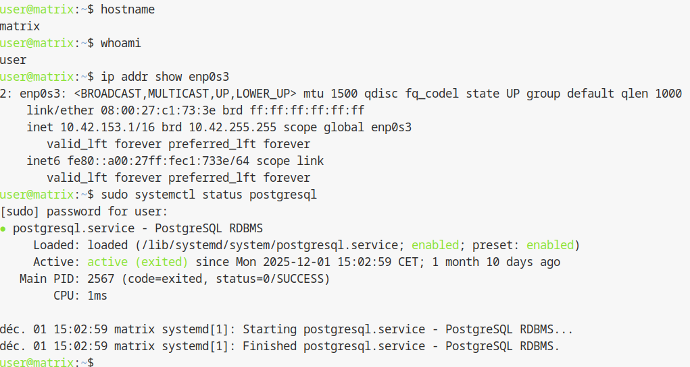

## Pre-requis pour la semaine 3

### Objectif
S'assurer que l'on est bien connecte sur la machine virtuelle (et non sur le serveur de virtualisation `dattier`) et que l'on dispose des droits d'administration necessaires pour la suite des manipulations.

---

### Schéma de l'infrastructure à vérifier

```text
[ Poste Physique ] --- (Tunnel SSH) ---> [ Serveur Dattier ]
                                               |
                                               v
                                     [ VM Matrix (10.42.XX.1) ]
                                               |
                                               |-- [ OS: Debian (Hostname: matrix) ]
                                               |-- [ Privilèges: sudo ]
                                               |-- [ SGBD: PostgreSQL (Active) ]
```

---

Avant d'entamer l'installation du serveur Synapse, il est imperatif de verifier que le travail des semaines precedentes (semaines 1 et 2) est fonctionnel. L'installation de cette semaine repose entierement sur ces bases.

---

## 1. Etat de la machine virtuelle (VM)

Votre VM doit etre demarree et correctement configuree.

* Nom de la machine (hostname) : la machine doit s'appeler `matrix` et non `debian`.
* Reseau : la machine doit avoir une adresse IP dans le reseau prive (generalement `10.42.XX.x`).

Commande de verification (dans la VM) :

```bash
hostname
```

Doit retourner : `matrix`.

---

## 2. Acces et droits d'administration

Vous devez pouvoir vous connecter a la VM via SSH sans entrer de mot de passe a chaque saut (configuration ProxyJump fonctionnelle) et disposer des droits d'administration.

Verification des droits `sudo` :

```bash
sudo id
```

Doit retourner : `uid=0(root) gid=0(root) groupes=0(root)...`.

Si cette commande demande un mot de passe et fonctionne, vos droits sont valides.

---

## 3. Base de donnees (PostgreSQL)

Le service de base de donnees PostgreSQL a ete installe en semaine 2. Il doit etre actif, car Synapse ne pourra pas demarrer sans lui.

Verification du service :

```bash
sudo systemctl status postgresql
```

Doit afficher : `Active: active (running)`.

Verification de l'utilisateur de base de donnees : l'utilisateur `matrix` doit exister dans PostgreSQL.

```bash
sudo -u postgres psql -c "\du"
```

Doit afficher une ligne avec le role `matrix`.

---

## 4. Environnement de la machine physique

Pour la semaine 3, nous aurons besoin de connaitre le nom exact de la machine physique sur laquelle vous travaillez (ex : `frene07`, `epicea12`, etc.), car ce nom servira a configurer le serveur Synapse.

Commande pour recuperer le nom (sur le PC physique) :

```bash
hostname -f
```

Exemple de resultat : `frene10.iut-infobio.priv.univ-lille1.fr`.

---

## Section dédiée aux problèmes (Troubleshooting)

| Problème | Cause possible | Solution |
| :--- | :--- | :--- |
| **Le hostname est "debian"** | La procédure 2.1 n'a pas été finalisée ou enregistrée. | Reprenez la modification de `/etc/hostname` et `/etc/hosts` puis faites un `reboot`. |
| **`sudo id` : "user is not in the sudoers file"** | L'utilisateur n'a pas été ajouté au groupe sudo ou n'a pas relancé sa session. | Repassez en root (`su -`), faites `adduser user sudo`, puis quittez et relancez le SSH. |
| **PostgreSQL est "inactive (dead)"** | Le service n'est pas configuré pour démarrer au boot. | Faites `sudo systemctl enable --now postgresql`. |
| **L'IP n'est pas 10.42.XX.1** | Erreur dans le fichier `/etc/network/interfaces`. | Vérifiez la configuration statique de la semaine 1. |
| **L'utilisateur "matrix" n'existe pas dans la DB** | La création du rôle PostgreSQL a été oubliée. | Refaites `sudo -u postgres createuser -P matrix`. |

---

## Section Tests de validation finale

Si tous ces points sont valides, vous pouvez passer a la procedure 3.1. Effectuez ce test de connectivité final :

1.  **Test d'accès externe depuis la VM :**
    ```bash
    ping -c 2 google.fr
    ```
    *Résultat attendu : Les paquets doivent revenir (indispensable pour télécharger les paquets Synapse).*



---
- Page précédente: [Sommaire (partie 3)](../3-synapse/README.md)
- Page suivante: - [3.1 : Installation et vérification d’un service HTTP](installation-verif-service-http.md)