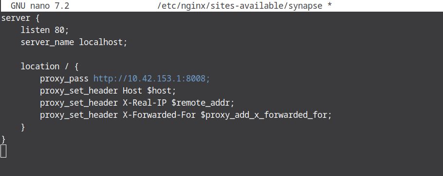

## 4.5 Installation et configuration d'Element Web sur la VM `matrix`

Une fois le reverse proxy operationnel sur la machine `rproxy`, il reste a installer l'interface Element Web sur la machine `matrix`.

Element Web est un client Matrix cote navigateur.
Il ne contient aucun code serveur : uniquement des fichiers statiques (HTML, CSS, JavaScript).
Pour les rendre accessibles, nous allons donc utiliser Nginx comme serveur web sur la VM `matrix`.

**Objectif :** Rendre l'interface Element Web accessible sur le port **8080** de la machine `matrix`.

---

### Schéma d'architecture (Service Web Statique)

```text
[ PC Physique (Navigateur) ] 
       |
       | (Tunnel SSH via Port 8080)
       v
[ VM Matrix (10.42.XX.1) ]
       |
       |-- [ Serveur Nginx (Port 8080) ]
                |
                |-- Lit les fichiers dans : /var/www/element/
```

---

## 4.5.1 Preparation des fichiers d'Element Web

### Principe

Nginx ne "comprend" pas Element :
il se contente de servir des fichiers depuis un dossier donne.

Nous devons donc :

* creer un dossier dedie,
* y placer les fichiers d'Element Web.

### Creation du dossier de destination

Nous choisissons `/var/www/element`, emplacement standard pour des sites web.

```bash
sudo mkdir -p /var/www/element
```

* `-p` permet de creer le dossier meme si les parents n'existent pas.
* `/var/www` est le repertoire conventionnel pour les contenus web.

### Extraction de l'archive Element Web

Une fois l'archive `element-web-v1.x.x.tar.gz` presente sur la VM (telechargee ou copiee), on la decompresse :

```bash
# Exemple avec la version 1.11.55 (adapter selon la version téléchargée)
sudo tar -xzf element-v1.11.55.tar.gz -C /var/www/element --strip-components=1
```

Explication des options :

* `-x` : extraire
* `-z` : archive compressee gzip
* `-f` : fichier a extraire
* `-C` : dossier de destination
* `--strip-components=1` : evite d'avoir un sous-dossier inutile et place directement `index.html`, `config.json`, etc. dans `/var/www/element`.

A ce stade, le fichier suivant doit exister :

```
/var/www/element/index.html
```

---

## 4.5.2 Configuration du serveur web Nginx (virtual host)

Nous allons maintenant expliquer a Nginx :

"Sur le port 8080, affiche le contenu du dossier `/var/www/element`."

### Creation du fichier de configuration

```bash
sudo nano /etc/nginx/sites-available/element
```

### Contenu du fichier de configuration

```nginx
server {
    listen 80;
    server_name localhost;

    location / {
        proxy_pass http://10.42.XX.1:8008;
        proxy_set_header Host $host;
        proxy_set_header X-Real-IP $remote_addr;
        proxy_set_header X-Forwarded-For $proxy_add_x_forwarded_for;
    }
}
```

### Explication pedagogique des directives

**`listen 8080;`**
Le port 8080 est volontairement choisi pour eviter tout conflit avec :

* le reverse proxy (port 80),
* d'autres services web eventuels.

**`root /var/www/element;`**
Indique a Nginx ou se trouvent les fichiers HTML, CSS et JS d'Element.

**`index index.html;`**
Definit la page chargee automatiquement quand on accede a `/`.

**`try_files`**
Securite minimale :
si un fichier n'existe pas, Nginx renvoie une erreur 404 au lieu d'un comportement imprevu.


Exemple : 



---

## 4.5.3 Activation et verification de la configuration

### Activation du site

Comme toujours avec Nginx, il faut activer le site via un lien symbolique :

```bash
sudo ln -s /etc/nginx/sites-available/element /etc/nginx/sites-enabled/
```

### Verification de la configuration

Avant toute application, on verifie la syntaxe :

```bash
sudo nginx -t
```

Resultat attendu :

```text
syntax is ok
test is successful
```

### Rechargement de Nginx

```bash
sudo systemctl reload nginx
```

Le rechargement applique la nouvelle configuration sans couper le service.

---

## 4.5.4 Acces depuis la machine physique (tunnel SSH)

La VM `matrix` est situee dans un reseau prive (`10.42.XX.0/16`).
Elle n'est donc pas accessible directement depuis le navigateur du Mac.

Nous utilisons un tunnel SSH pour exposer temporairement le port 8080.

### Creation du tunnel SSH (depuis le Mac)

```bash
ssh -L 8080:localhost:8080 user@10.42.XX.1
```

Signification de la commande :

* `-L 8080:localhost:8080` :
  * port 8080 du Mac → port 8080 de la VM `matrix`
* `user@10.42.XX.1` :
  * connexion SSH vers la VM `matrix`

Attention : la connexion SSH doit rester ouverte pour que le tunnel fonctionne.

### Test final

Depuis le navigateur du Mac, ouvrir :

```text
http://localhost:8080
```

Resultat attendu :

* affichage de l'interface Element Web,
* page de connexion visible,
* aucune erreur Nginx.

---

## Section dédiée aux problèmes (Troubleshooting)

| Problème | Cause possible | Solution |
| :--- | :--- | :--- |
| **Erreur 403 Forbidden** | Nginx n'a pas les droits de lecture sur `/var/www/element`. | Appliquer `sudo chmod -R 755 /var/www/element`. |
| **Erreur 404 Not Found** | Le fichier `index.html` n'est pas à la racine du dossier `root`. | Vérifier l'extraction avec `ls /var/www/element`. |
| **Le tunnel SSH ne se lance pas** | Le port 8080 est déjà utilisé sur le PC physique. | Tenter un autre port local : `ssh -L 9000:localhost:8080...`. |
| **Nginx affiche la page par défaut** | Le site `default` de Nginx est toujours actif. | Supprimer le lien dans `sites-enabled/default` et recharger. |

---

## Section Tests de validation

Afin de s'assurer du bon fonctionnement, effectuez les tests suivants :

1.  **Test de syntaxe Nginx :** Tapez `sudo nginx -t`. (Doit retourner *successful*).
2.  **Test de présence des fichiers :** Tapez `ls /var/www/element/index.html`. (Le fichier doit être présent).
3.  **Test de réponse locale :** Depuis la VM `matrix`, tapez `curl -I http://localhost:8080`.
    *Résultat attendu : HTTP/1.1 200 OK.*
4.  **Test d'accès tunnel :** Vérifiez sur votre PC physique que `localhost:8080` affiche bien l'interface Element Web.

<hr>

- Page précédente: [4.4 : Mise en place du flux reverse proxy dans Nginx](mise-en-place-flux-reverse-proxy-nginx.md)
- Page suivante:  [4.6 : Accès aux services et validation de l'architecture](Acces-service-validation-de-architecture.md)
