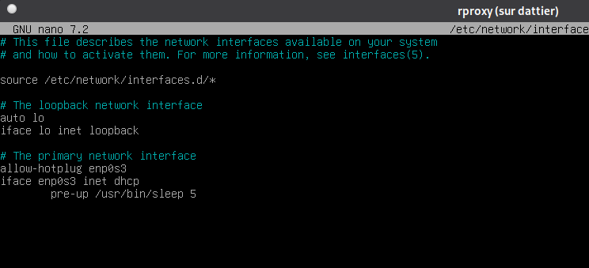
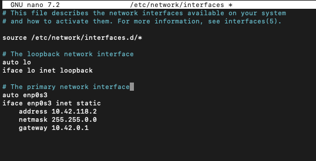

# 4.3 – Installation et configuration reseau de la VM `rproxy`

### Schéma d'architecture (Positionnement du Proxy)

```text
[ Poste Physique (Mac/PC) ] 
       |
       | (Tunnel SSH / Flux HTTP Port 80)
       v
[ Serveur dattier.iutinfo.fr ]
       |
       |--- [ VM rproxy (10.42.XX.2) ]  <-- Cible de cette procédure
       |          | (Reverse Proxy Nginx)
       |          v
       |--- [ VM matrix (10.42.XX.1) ]
                  | (Serveur Synapse Port 8008)
```

---

## Objectif

Cette procedure decrit la mise en place d'une machine virtuelle dediee au role de **reverse proxy**.
L'objectif est de **separer le point d'entree HTTP** du serveur applicatif Synapse afin de respecter les principes de **segmentation reseau**, de **securite** et de **maintenabilite**.

---

## 4.3.1 Creation et parametres de la machine virtuelle

La machine virtuelle `rproxy` est creee sur le serveur de virtualisation `dattier` a l'aide de l'outil `vmiut`, deja utilise lors des etapes precedentes du projet.

### Creation de la VM

```bash
vmiut create rproxy
```

Cette commande :

* cree une nouvelle VM nommee `rproxy`,
* initialise son disque a partir du modele Debian *bookworm* fourni par l'IUT,
* configure automatiquement les parametres VirtualBox standards.

### Parametres retenus

Les parametres appliques a la machine respectent les contraintes du projet :

* **Nom** : `rproxy`
* **Memoire vive** : 1024 Mo
* **Reseau** : mode *Bridged* sur l'interface `vboxtap0`

Ce mode reseau permet a la VM d'etre integree directement au reseau virtuel `10.42.0.0/16`, commun aux autres machines du projet.

---

## 4.3.2 Acces initial a la machine et resolution des incidents

Lors du premier demarrage, l'acces a la machine a necessite une approche specifique en raison de limitations techniques.

### A. Contournement de l'erreur d'affichage (X11)

La commande suivante n'a pas fonctionne :

```bash
vmiut console rproxy
```

Cette erreur est liee a l'absence de redirection graphique X11 fonctionnelle.
Pour contourner ce probleme, nous avons choisi d'acceder a la machine **via SSH**, ce qui necessite de connaitre son adresse IP temporaire.

### Recuperation de l'IP attribuee par DHCP

```bash
vmiut info rproxy
```

Dans la sortie, la ligne `ip-potentielle1` indique l'adresse IP attribuee dynamiquement au demarrage.
Dans notre cas :

```text
ip-potentielle1 = 10.42.88.71
```

### Connexion SSH a la VM

```bash
ssh user@10.42.88.71
```

Cette connexion permet d'acceder a la machine avec l'utilisateur standard `user`.

---

## 4.3.3 Passage en mode administrateur (root)

L'utilisateur `user` ne dispose pas des privileges necessaires pour modifier la configuration systeme ou installer des services.

Il est donc indispensable de basculer vers le compte administrateur.

```bash
su -
```

Cette commande :

* change d'utilisateur pour `root`,
* charge l'environnement complet administrateur,
* permet l'acces total au systeme.

Le prompt se termine desormais par `#`, confirmant les droits root.

---

## 4.3.4 Configuration d'une adresse IP statique

Pour garantir la stabilite du reseau, la VM `rproxy` doit disposer d'une **adresse IP fixe**.
Cette adresse servira de cible permanente pour les redirections SSH et le reverse proxy.

### Edition du fichier de configuration reseau

```bash
nano /etc/network/interfaces
```

La configuration DHCP existante de l'interface `enp0s3` est remplacee par la configuration suivante :

```text
auto enp0s3
iface enp0s3 inet static
    address 10.42.XX.2
    netmask 255.255.0.0
    gateway 10.42.0.1
```

De base :



Avec modifications : 



### Explication de la configuration

* `auto enp0s3`
  → l'interface est activee automatiquement au demarrage.
* `iface enp0s3 inet static`
  → desactivation du DHCP, utilisation d'une IP fixe.
* `address 10.42.XX.2`
  → adresse definitive de la VM `rproxy`.
* `netmask 255.255.0.0`
  → masque `/16`, coherent avec le reseau `10.42.0.0/16`.
* `gateway 10.42.0.1`
  → routeur du reseau virtuel.

### Application de la configuration

```bash
ifdown enp0s3 && ifup enp0s3
```

Attention : cette commande coupe temporairement la connexion SSH.
C'est un comportement normal : l'interface redemarre avec la nouvelle configuration.

Apres cette etape, la machine est accessible **uniquement** via l'adresse IP statique `10.42.XX.2`.

---

## 4.3.5 Installation des outils de base

Une fois reconnecte en tant que `root`, nous installons le serveur web qui assurera le role de reverse proxy.

### Mise a jour des depots

```bash
apt update
```

### Installation de Nginx

```bash
apt install nginx -y
```

Nginx est retenu car :

* il est leger et performant,
* il est parfaitement adapte au reverse proxy HTTP,
* il sera egalement utilise pour servir Element Web, assurant une coherence technique.

---

## Section dédiée aux problèmes (Dépannage)

| Problème | Cause possible | Solution |
| :--- | :--- | :--- |
| **Erreur "Can't open display" (vmiut console)** | Redirection X11 absente sur votre tunnel SSH vers Dattier. | Utilisez le contournement SSH décrit en 4.3.2 en récupérant l'IP DHCP. |
| **Perte de connexion après `ifdown && ifup`** | L'IP a changé (passage au mode statique). | Fermez votre terminal et reconnectez-vous sur la nouvelle IP : `10.42.XX.2`. |
| **`apt update` échoue** | La VM n'a pas accès à Internet (Passerelle ou DNS mal configurés). | Vérifiez que `gateway 10.42.0.1` est bien écrit et que `/etc/resolv.conf` contient un DNS valide. |
| **Conflit d'IP** | Une autre machine utilise déjà l'adresse `10.42.XX.2`. | Vérifiez votre affectation d'IP (XX) dans les consignes du TP. |

---

## Section Tests de validation

Afin de vérifier que la VM `rproxy` est correctement configurée, effectuez les tests suivants :

1.  **Vérification de l'IP statique :**
    ```bash
    ip addr show enp0s3 | grep "inet "
    ```
    *Le retour doit afficher l'IP `10.42.XX.2`.*

2.  **Vérification de l'état de Nginx :**
    ```bash
    systemctl is-active nginx
    ```
    *Le retour doit être `active`.*

3.  **Vérification de l'écoute réseau :**
    ```bash
    ss -ltn | grep :80
    ```
    *Le service doit écouter sur le port 80 (HTTP).*

---

## Resumé

* `vmiut create` permet de creer une VM a partir du modele fourni.
* L'acces SSH est utilise lorsque la console graphique n'est pas disponible.
* `su -` est indispensable pour effectuer des modifications systeme.
* Une IP statique garantit la stabilite des redirections reseau.
* Nginx constitue la brique centrale du reverse proxy.

A l'issue de cette procedure, la VM `rproxy` est **operationnelle**, **stable sur le reseau**, et prete a recevoir la configuration du reverse proxy pour Synapse.

<hr>

- Page précédente: [4.2 : Introduction et choix d'un reverse proxy](reverse-proxy-choix.md)
- Page suivante: [4.4 : Mise en place du flux reverse proxy dans Nginx](mise-en-place-flux-reverse-proxy-nginx.md)
