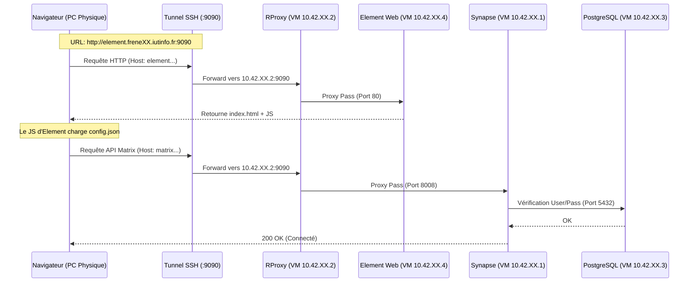

# 5.5 Installation et configuration de Synapse (VM `matrix`)

## Objectif

Installer Synapse, le connecter a la base PostgreSQL (VM externe), et le configurer pour un environnement de TP (inscription ouverte, pas de federation internet).

---

## 1) Schema d’architecture

- Flux : RProxy -> Synapse -> PostgreSQL
- Adressage :

  - VM `matrix` (Synapse) : `10.42.XX.1`
  - VM `db` (PostgreSQL) : `10.42.XX.3` (alias DNS local : `postgres`)

---

## 2) Procedure pas a pas

### A. Pre-requis : Configuration du DNS local (Crucial)

Synapse va chercher a contacter la base de donnees via le nom `postgres`. Il faut donc definir ce nom.

Editer `/etc/hosts` :

```bash
sudo nano /etc/hosts
```

Ajouter/Modifier les lignes pour correspondre a ceci (adapter `XX`) :

```text
10.42.XX.1  matrix
10.42.XX.2  rproxy
10.42.XX.3  postgres
10.42.XX.4  element
```

Pourquoi : dans votre configuration YAML, vous avez defini `host: postgres`. Sans cette ligne, Synapse ne trouvera pas l'IP `10.42.XX.3`.

---

### B. Installation des paquets

```bash
sudo apt update
sudo apt install -y lsb-release wget apt-transport-https ca-certificates systemd
```

Ajouter le depot Matrix et installer :

```bash
sudo wget -O /usr/share/keyrings/matrix-org-archive-keyring.gpg https://packages.matrix.org/debian/matrix-org-archive-keyring.gpg

echo "deb [signed-by=/usr/share/keyrings/matrix-org-archive-keyring.gpg] https://packages.matrix.org/debian/ $(lsb_release -cs) main" | sudo tee /etc/apt/sources.list.d/matrix-org.list >/dev/null

sudo apt update
sudo apt install -y matrix-synapse-py3 python3-psycopg2
```

Note : si l'installeur demande un nom de serveur, mettez `matrix.freneXX.iutinfo.fr:9090`.

---

### C. Configuration de `homeserver.yaml` (l'etape critique)

C'est ici que l'on applique votre configuration specifique.

Arreter le service et nettoyer la base par defaut :

```bash
sudo systemctl stop matrix-synapse
sudo rm -f /var/lib/matrix-synapse/homeserver.db
```

Pourquoi : on supprime la base SQLite par defaut pour forcer l'utilisation de PostgreSQL.

Editer la configuration :

```bash
sudo nano /etc/matrix-synapse/homeserver.yaml
```

Appliquer les modifications bloc par bloc (attention a l'indentation).

#### Bloc 1 : Listeners (reseau)

Remplacer la section `listeners:` existante par :

```yaml
listeners:
  - port: 8008
    tls: false
    type: http
    x_forwarded: true
    bind_addresses: ['0.0.0.0']
    resources:
      - names: [client, federation]
        compress: false
```

Pourquoi `bind_addresses: ['0.0.0.0']` ? Par defaut, Synapse ecoute sur 127.0.0.1 (local uniquement). `0.0.0.0` force l'ecoute sur toutes les interfaces, permettant a votre Reverse Proxy (sur une autre VM) de s'y connecter.

Pourquoi `x_forwarded: true` ? Indispensable derriere un reverse proxy (Nginx). Cela dit a Synapse d'utiliser les en-tetes HTTP speciaux pour identifier la veritable IP des clients (sinon tous les clients sembleront venir de l'IP du proxy).

#### Bloc 2 : Database (stockage)

Commenter l'ancienne section `database` et mettre celle-ci :

```yaml
database:
  name: psycopg2
  args:
    user: synapse_user
    password: aubin
    database: synapse
    host: postgres
    cp_min: 5
    cp_max: 10
```

Pourquoi : on bascule de SQLite (lent, fichier local) vers PostgreSQL (performant, reseau).

Pourquoi `host: postgres` ? Synapse utilisera le fichier `/etc/hosts` configure a l'etape A pour trouver l'IP `10.42.XX.3`.

#### Bloc 3 : URLs et cles (identification)

Modifier ou ajouter ces lignes (souvent au debut ou a la fin du fichier) :

```yaml
server_name: "matrix.freneXX.iutinfo.fr:9090"
public_baseurl: "http://matrix.freneXX.iutinfo.fr:9090"

# Desactivation de la federation externe
trusted_key_servers: []
```

Pourquoi `trusted_key_servers: []` ? Dans un environnement clos (IUT), Synapse ne peut pas contacter les serveurs maitres (matrix.org). On vide cette liste pour eviter des erreurs de timeout et des lenteurs au demarrage.

Pourquoi `public_baseurl` ? Permet a Synapse de generer correctement les liens d'invitation et les URL de medias visibles depuis l'exterieur.

#### Bloc 4 : Inscription et telemetrie (facilites TP)

Ajouter ou modifier a la fin du fichier :

```yaml
report_stats: no

enable_registration: true
enable_registration_without_verification: true
registration_shared_secret: "aubin"
```

Pourquoi `enable_registration_without_verification: true` ? C'est la cle du TP. Cela permet de creer des comptes utilisateurs depuis Element sans avoir besoin d'un serveur d'envoi d'emails (SMTP) ni de captcha. En production, c'est une faille de securite, mais en TP, c'est indispensable pour tester rapidement.

Pourquoi `report_stats: no` ? Confidentialite et economie de bande passante (pas d'envoi de donnees a Matrix.org).

---

### D. Demarrage et verification

Redemarrer le service :

```bash
sudo systemctl start matrix-synapse
```

Verifier les logs en direct (pour voir si la connexion DB fonctionne) :

```bash
sudo tail -f /var/log/matrix-synapse/homeserver.log
```

Vous devez voir des lignes indiquant "Connection established" ou "Synapse started". Si vous voyez "FATAL... password authentication failed", verifiez le mot de passe dans le YAML.

---
## 3) Script d'automatisation de la procedure

Pour eviter les erreurs manuelles lors de l'edition du fichier YAML, voici un script Bash complet qui realise l'installation et la configuration automatiquement.

Utilisation :

- Creer le fichier : `nano install_synapse.sh`
- Coller le contenu ci-dessous.
- Rendre executable : `chmod +x install_synapse.sh`
- Lancer avec sudo : `sudo ./install_synapse.sh`

```bash
#!/bin/bash
set -e # Arret immediat en cas d'erreur

# --- CONFIGURATION UTILISATEUR ---
echo "============================================="
echo "   INSTALLATION AUTOMATISEE DE SYNAPSE       "
echo "============================================="
read -p "Entrez votre numero XX (ex: 01, 118) : " XX

# Variables derivees
SERVER_NAME="matrix.{XX}.iutinfo.fr:9090"
DB_ALIAS="postgres"
DB_IP="10.42.${XX}.3"

echo ">> Configuration :"
echo "   Server Name : $SERVER_NAME"
echo "   Database IP : $DB_IP ($DB_ALIAS)"
echo "============================================="

# 1. Configuration du DNS Local (/etc/hosts)
echo "[1/6] Configuration du DNS local..."
if ! grep -q "$DB_ALIAS" /etc/hosts; then
    echo "$DB_IP $DB_ALIAS" >> /etc/hosts
    echo ">> Ajout de $DB_ALIAS dans /etc/hosts"
else
    echo ">> $DB_ALIAS existe deja dans /etc/hosts"
fi

# 2. Preparation des depots et installation
echo "[2/6] Installation des paquets..."
apt update -q
apt install -y lsb-release wget apt-transport-https ca-certificates systemd -q

# Ajout cle et depot Matrix
wget -qO /usr/share/keyrings/matrix-org-archive-keyring.gpg https://packages.matrix.org/debian/matrix-org-archive-keyring.gpg
echo "deb [signed-by=/usr/share/keyrings/matrix-org-archive-keyring.gpg] https://packages.matrix.org/debian/ $(lsb_release -cs) main" | tee /etc/apt/sources.list.d/matrix-org.list >/dev/null
apt update -q

# Pre-configuration du nom de serveur pour eviter la fenetre interactive
echo "matrix-synapse-py3 matrix-synapse/server-name string $SERVER_NAME" | debconf-set-selections
echo "matrix-synapse-py3 matrix-synapse/report-stats boolean false" | debconf-set-selections

# Installation des binaires et du driver SQL
apt install -y matrix-synapse-py3 python3-psycopg2 -q

# 3. Arret du service et nettoyage
echo "[3/6] Arret du service et nettoyage SQLite..."
systemctl stop matrix-synapse
rm -f /var/lib/matrix-synapse/homeserver.db

# 4. Generation du fichier de configuration (homeserver.yaml)
echo "[4/6] Ecriture de la configuration homeserver.yaml..."

# On sauvegarde l'ancien fichier au cas ou
mv /etc/matrix-synapse/homeserver.yaml /etc/matrix-synapse/homeserver.yaml.bak 2>/dev/null || true

# On genere un fichier propre avec VOS parametres specifiques
cat <<EOF > /etc/matrix-synapse/homeserver.yaml
# --- Configuration generee par script TP ---
server_name: "$SERVER_NAME"
pid_file: /var/run/matrix-synapse.pid
public_baseurl: "http://$SERVER_NAME"

listeners:
  - port: 8008
    tls: false
    type: http
    x_forwarded: true
    bind_addresses: ['0.0.0.0']
    resources:
      - names: [client, federation]
        compress: false

database:
  name: psycopg2
  args:
    user: synapse_user
    password: aubin
    database: synapse
    host: postgres
    cp_min: 5
    cp_max: 10

# Logs et Stockage
log_config: "/etc/matrix-synapse/log.yaml"
media_store_path: "/var/lib/matrix-synapse/media"
signing_key_path: "/etc/matrix-synapse/homeserver.signing.key"

# Parametres TP (Isolation et Inscription)
trusted_key_servers: []
report_stats: no
registration_shared_secret: "aubin"
enable_registration: true
enable_registration_without_verification: true
EOF

# 5. Permissions
echo "[5/6] Application des permissions..."
chown -R matrix-synapse:nogroup /etc/matrix-synapse
chown -R matrix-synapse:nogroup /var/lib/matrix-synapse
chmod 640 /etc/matrix-synapse/homeserver.yaml

# 6. Demarrage
echo "[6/6] Demarrage de Synapse..."
systemctl enable --now matrix-synapse

echo "============================================="
echo "   INSTALLATION TERMINEE AVEC SUCCES         "
echo "============================================="
echo "Verifiez les logs avec : sudo tail -f /var/log/matrix-synapse/homeserver.log"
```
---
## 4) Script de migration (VM `matrix`)

Voici un script complet et robuste pour la VM `matrix`. Il automatise le changement d'adressage IP et la reconfiguration de Synapse en une seule commande.

### Pourquoi ce script est indispensable ?

Lorsque vous changez de poste en TP (ex: de `frene01` vers `frene11`), deux choses fondamentales changent :

- Votre identite reseau (IP) : votre plage IP change (le `XX` change), donc votre VM doit changer d'IP, sinon elle sera en conflit ou injoignable.
- Votre identite applicative (domaine) : le nom de domaine `matrix.frene01.iutinfo.fr` devient `matrix.frene11.iutinfo.fr`. Si vous ne mettez pas a jour Synapse, il continuera de generer des liens (invitations, medias) avec l'ancien nom, et Element ne pourra plus s'y connecter.

---

### A) Creation du script `migration_matrix.sh`

Sur la VM `matrix`, creez le fichier en root :

```bash
sudo nano /usr/local/bin/migration_matrix.sh
```

Copiez-collez le code ci-dessous :

```bash
#!/bin/bash
# Script de migration automatique pour la VM MATRIX
# Auteur : Votre Nom
# Usage : sudo migration_matrix.sh [NOM_MACHINE_PHYSIQUE] [NOUVEAU_XX]

NEW_PHYSIQUE=$1
NEW_XX=$2

# --- VERIFICATIONS ---
if [ -z "$NEW_PHYSIQUE" ] || [ -z "$NEW_XX" ]; then
    echo "ERREUR : Arguments manquants."
    echo "Usage : sudo migration_matrix.sh [NOM_MACHINE] [XX]"
    echo "Exemple : sudo migration_matrix.sh frene11 118"
    exit 1
fi

if [ "$(id -u)" -ne 0 ]; then
    echo "ERREUR : Ce script doit etre lance avec sudo."
    exit 1
fi

echo "=================================================="
echo " DEBUT DE LA MIGRATION VERS : $NEW_PHYSIQUE (XX=$NEW_XX)"
echo "=================================================="

# 1. MISE A JOUR RESEAU SYSTEME (/etc/network/interfaces)
echo "[1/5] Mise a jour de l'IP systeme..."
IFACE_FILE="/etc/network/interfaces"
# Remplace n'importe quel 10.42.quelquechose. par 10.42.NOUVEAU_XX.
sed -i "s/10\.42\.[0-9]*\./10.42.$NEW_XX./g" $IFACE_FILE

# 2. MISE A JOUR DNS LOCAL (/etc/hosts)
echo "[2/5] Mise a jour du fichier hosts..."
HOSTS_FILE="/etc/hosts"
# Met a jour les IPs des autres VMs (db, rproxy, etc.)
sed -i "s/10\.42\.[0-9]*\./10.42.$NEW_XX./g" $HOSTS_FILE

# 3. MISE A JOUR CONFIGURATION SYNAPSE (homeserver.yaml)
echo "[3/5] Reconfiguration de Synapse..."
HS_FILE="/etc/matrix-synapse/homeserver.yaml"
SERVER_NAME_FILE="/etc/matrix-synapse/conf.d/server_name.yaml"

# A. Mise a jour du server_name (Domaine)
# Cherche matrix.quelquechose.iutinfo et remplace par le nouveau
sed -i "s/matrix\..*\.iutinfo\.fr/matrix.$NEW_PHYSIQUE.iutinfo.fr/g" $HS_FILE

# B. Mise a jour de l'URL publique (public_baseurl)
sed -i "s/http:\/\/matrix\..*\.iutinfo\.fr/http:\/\/matrix.$NEW_PHYSIQUE.iutinfo.fr/g" $HS_FILE

# C. Mise a jour de server_name.yaml (Specifique Debian)
if [ -f "$SERVER_NAME_FILE" ]; then
    sed -i "s/server_name: .*/server_name: \"matrix.$NEW_PHYSIQUE.iutinfo.fr:9090\"/g" $SERVER_NAME_FILE
fi

# D. Mise a jour IP Database (Au cas ou elle est en dur et pas via /etc/hosts)
sed -i "s/host: \"10\.42\.[0-9]*\.3\"/host: \"10.42.$NEW_XX.3\"/g" $HS_FILE

# 4. MISE A JOUR DU HOSTNAME
echo "[4/5] Changement du nom de la VM..."
hostnamectl set-hostname "matrix-$NEW_XX"

# 5. APPLICATION DES CHANGEMENTS
echo "[5/5] Redemarrage des services..."

# Recharger le reseau (Attention : cela peut couper SSH si l'IP change)
ifdown enp0s3 --force > /dev/null 2>&1
ifup enp0s3 > /dev/null 2>&1

# Redemarrer Synapse
systemctl restart matrix-synapse

echo "=================================================="
echo " MIGRATION TERMINEE."
echo " Nouvelle IP : 10.42.$NEW_XX.1"
echo " Nouveau Serveur : matrix.$NEW_PHYSIQUE.iutinfo.fr"
echo "=================================================="
echo "NOTE : Si vous etes en SSH, votre session va figer."
echo "Veuillez vous reconnecter sur la nouvelle IP : ssh user@10.42.$NEW_XX.1"
```

---

### B) Rendre le script executable

```bash
sudo chmod +x /usr/local/bin/migration_matrix.sh
```

---

### C) Utilisation (exemple concret)

Imaginez que vous arriviez en debut de seance :

- Vous vous asseyez au poste `frene04`.
- Moodle indique que votre plage reseau est `105`.

Il vous suffit de lancer cette unique commande :

```bash
sudo migration_matrix.sh frene04 105
```

Le script va automatiquement :

- Changer votre IP en `10.42.105.1`.
- Dire a Synapse d'utiliser le domaine `matrix.frene04.iutinfo.fr`.
- Mettre a jour le fichier `/etc/hosts` pour que la VM trouve la base de donnees en `10.42.XX.3`.
- Redemarrer le tout.


---

## 5) Tests de validation

| Test | Commande | Resultat attendu |
| --- | --- | --- |
| Service actif | `systemctl status matrix-synapse` | `active (running)` |
| Ecoute reseau | `sudo ss -lntp \| grep 8008` | ecoute sur 8008 |
| API accessible | `curl http://localhost:8008/_matrix/client/versions` | reponse JSON `{"versions": ...}` |
| Pas d'erreur DB | `grep "Error" /var/log/matrix-synapse/homeserver.log` | aucune erreur critique recente |

---

## 6) Problème

- Erreur `host not found: postgres` dans les logs
  - Cause : vous avez oublie de configurer `/etc/hosts` (etape A).
  - Solution : ajoutez `10.42.XX.3 postgres` dans `/etc/hosts` et redemarrez Synapse.
- Erreur `psycopg2.OperationalError` (auth failed)
  - Cause : le mot de passe `aubin` dans le YAML ne correspond pas a celui defini lors de la creation de l'user sur la VM DB.
  - Solution : verifiez le mot de passe dans le YAML ou changez-le sur la base de donnees (`ALTER USER synapse_user WITH PASSWORD 'aubin';`).
- Synapse demarre mais Element affiche "Erreur interne"
  - Cause : probleme d'indentation dans le YAML (souvent des tabulations au lieu d'espaces).
  - Solution : utilisez uniquement des espaces (2 par niveau) pour indenter `listeners` et `database`.

---

A) Note finale : 17/20
La procédure est logiquement correcte et couvre bien le parcours utilisateur. Cependant, il y a une incohérence majeure avec la procédure 5.6 concernant le port d'écoute du Reverse Proxy (80 vs 9090). Cette confusion peut empêcher le système de fonctionner si l'étudiant a suivi la 5.6 à la lettre (qui configurait Nginx sur listen 9090).

B) Détail du barème
Schéma & compréhension des flux : 3/4

Le flux est compris, mais le port du rproxy (80) contredit la configuration précédente (9090). Cela induit une erreur dans la définition du tunnel ou du listen Nginx.

Procédure pas à pas : 7/8

Le déroulé (Tests techniques -> Interface Web -> Inscription) est très pédagogique et progressif. C'est la bonne méthode.

Tests de validation : 3.5/4

Les commandes curl utilisent le port 80. Si Nginx écoute sur 9090 (comme dans la 5.6), ces tests échoueront ("Connection refused").

Troubleshooting : 3.5/4

Bonnes pistes, mais il manque le diagnostic des problèmes CORS (Cross-Origin Resource Sharing) qui surviennent souvent si les URL dans config.json ne correspondent pas exactement au server_name Nginx.

C) Liste des points bloquants
Conflit de ports (Critique) : Dans la 5.6, Nginx écoutait sur 9090. Ici, vous testez le port 80. Si vous ne changez pas la config Nginx pour écouter sur 80, rien ne marchera. Conseil : Restez sur 9090 partout pour simplifier, ou soyez explicite sur le mapping 9090->80.

Nom DNS phys : L'URL matrix.phys.iutinfo.fr est théorique. Si l'étudiant oublie de remplacer phys par freneXX, les certificats ou le routage échoueront.

URL dans config.json : Si Element pointe vers http://localhost:9090 (erreur fréquente) au lieu de l'URL publique, la connexion échouera pour les autres utilisateurs.

D) Améliorations concrètes (10 actions)
Intégrer un diagramme visuel : Remplacer le schéma texte par un diagramme de séquence Mermaid (voir plus bas) pour visualiser le flux HTTP.

Harmoniser le port Rproxy : Modifier les commandes de test pour utiliser le port 9090 (curl ... :9090), cohérent avec la procédure 5.6.

Vider le cache navigateur : Ajouter une étape "Ouvrir une navigation privée" ou "Vider le cache" avant le test Web (Element met en cache le config.json agressivement).

Vérifier le config.json en ligne de commande : Ajouter un grep base_url /var/www/html/element/config.json sur la VM element pour être sûr de l'URL avant de lancer Firefox.

Préciser le Tunnel SSH : Donner la commande exacte du tunnel pour le cas "Université" si l'accès direct n'est pas possible (souvent ssh -L 9090:10.42.XX.2:9090 ...).

Capture d'écran de succès : Demander explicitement une capture d'écran du message envoyé ("Bonjour...") comme preuve de réussite pour le rapport.

Test WebSocket : Ajouter un test curl spécifique pour vérifier que l'upgrade WebSocket passe le proxy (souvent source de bugs "Sync Error").

Vérification de l'heure : timedatectl sur toutes les VMs. Une désynchronisation > 5min empêche l'authentification Matrix.

Message d'erreur spécifique : Dans le troubleshooting, ajouter le cas "Invalid Homeserver" qui est souvent dû à un / en trop à la fin de l'URL dans config.json.

Ordre des logs : Suggérer d'ouvrir les logs (tail -f) avant de cliquer sur "S'inscrire" pour voir l'erreur en temps réel.

E) Réécriture d’un extrait critique (Diagramme de flux)
Je remplace votre schéma textuel par une version graphique et corrige l'incohérence de port (en supposant que vous gardez la logique de la 5.6, donc tout en 9090 pour simplifier).

1) Schéma des flux utilisateur (Validation Finale)

Extrait de code



Note pour vous : Si vous confirmez que vous voulez utiliser le port 80 sur le reverse proxy (ce qui est plus standard pour un serveur web interne, le 9090 n'étant que l'exposition externe), alors il faut modifier la procédure 5.6 pour listen 80; au lieu de listen 9090;. Si vous ne voulez pas toucher à la 5.6, alors modifiez cette procédure 5.7 pour faire les curl sur le port 9090.

---

- Page precedente: [5.4 : Installation de l'application Element (VM element)](installation-app-element.md)
- Page suivante: [5.6 : Installation et configuration du Reverse Proxy](config-rproxy.md)
